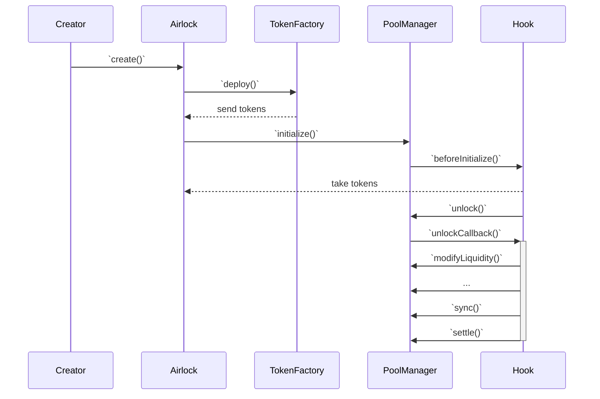

# Airlock

## Open Questions

- Should we premint the team allocation or not? If we don't premint it, then we'll have to mint in the migrate function, distribute the tokens and then transfer the ownership to the Timelock contract.

## Architecture

The Airlock contract takes care of the deployment of new tokens along with the initialization of the related hook and governance contracts. The system is flexible and can support different "modules" as long as they implement the required interfaces:

_Note: a "module" must be whitelisted before it can be used._

| Module            | Role                                      |
| ----------------- | ----------------------------------------- |
| TokenFactory      | Deploys asset tokens                      |
| GovernanceFactory | Deploys governance and timelock contracts |
| HookFactory       | Deploys hook contracts                    |
| Migrator          | Migrates tokens to a new hook             |

## Initialization

This sequence diagram describes the initialization of a new Doppler hook, along with the deployment of the related token:

