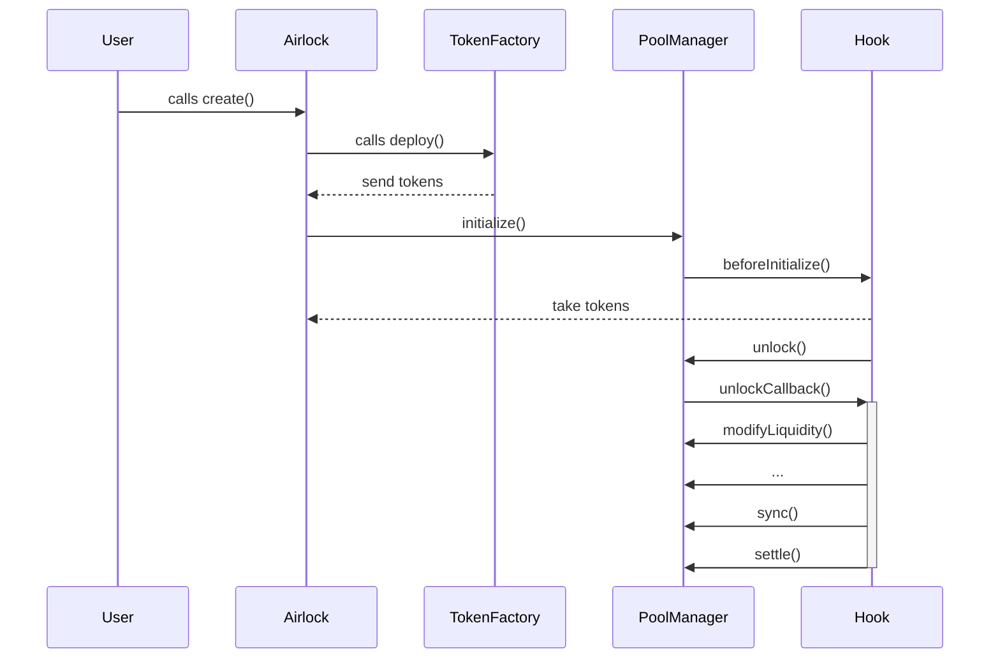

# Doppler

## Initialization

This sequence diagram explains how a new pair of token and pool is created:

```mermaid
sequenceDiagram
    participant U as User
    participant A as Airlock
    participant F as TokenFactory
    participant P as PoolManager
    participant H as Hook

    U->>A: calls create()
    A->>F: calls deploy()
    F-->>A: send tokens
    A->>P: initialize()
    P->>H: beforeInitialize()
    H-->>A: take tokens
    H->>P: unlock()
    P->>+H: unlockCallback()
    H->>P: modifyLiquidity()
    H->>P: ...
    H->>P: sync()
    H->>-P: settle()
```