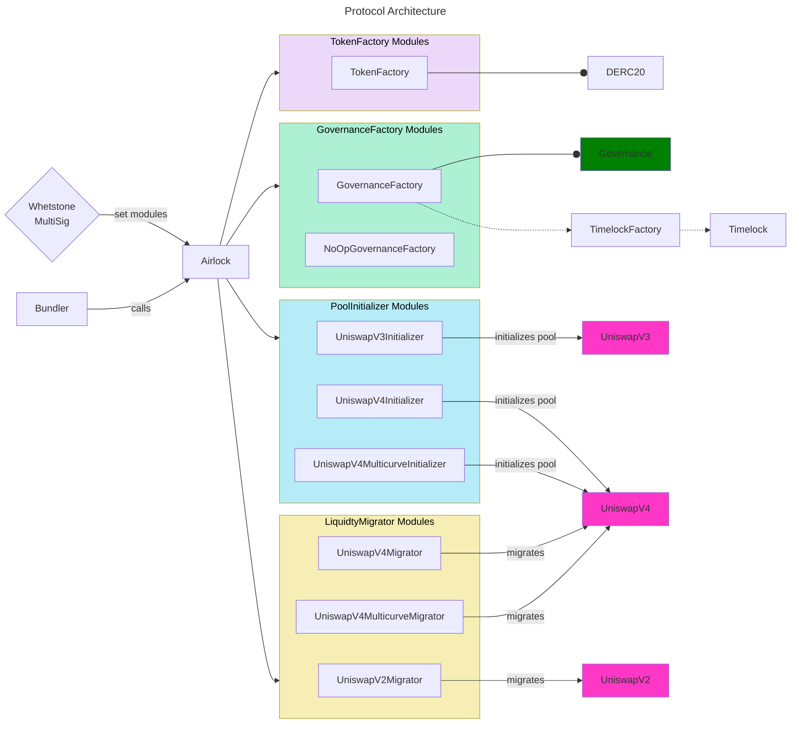

# Airlock

Airlock is a protocol facilitating the deployment of new tokens using a modular approach.

## Architecture

Different types of modules can be used to cover the several aspects of the token lifecycle:

| Module            | Role                                                    |
| ----------------- | ------------------------------------------------------- |
| TokenFactory      | Deploys the tokens                                      |
| GovernanceFactory | Deploys governance and timelock contracts               |
| PoolInitializer   | Initializes a liquidity pool, for example on Uniswap V3 |
| LiquidityMigrator | Migrates liquidity from one pool to another             |

_Note: a "module" must be whitelisted before it can be used._

Here is how the different modules interact with the `Airlock` contract:

## Available Modules

Here is a list of available modules:

| Module                                                                     | Type                | Description                                                                     |
| -------------------------------------------------------------------------- | ------------------- | ------------------------------------------------------------------------------- |
| [TokenFactory](./src/TokenFactory.sol)                                     | `TokenFactory`      | Deploys `DERC20` tokens                                                         |
| [GovernanceFactory](./src/GovernanceFactory.sol)                           | `GovernanceFactory` | Deploys `Governance` and `Timelock` contracts                                   |
| [NoOpGovernanceFactory](./src/NoOpGovernanceFactory.sol)                   | `GovernanceFactory` | Skips governance deployment                                                     |
| [UniswapV3Initializer](./src/UniswapV3Initializer.sol)                     | `PoolInitializer`   | Initializes a Uniswap V3 pool                                                   |
| [UniswapV4Initializer](./src/UniswapV4Initializer.sol)                     | `PoolInitializer`   | Initializes a Uniswap V4 pool with the Doppler hook                             |
| [UniswapV4MulticurveInitializer](./src/UniswapV4MulticurveInitializer.sol) | `PoolInitializer`   | Initializes a Uniswap V4 pool with liquidity distributed across multiple curves |
| [LockableUniswapV3Initializer](./src/LockableUniswapV3Initializer.sol)     | `PoolInitializer`   | Initializes a Uniswap V3 pool and locks liquidity for a defined period          |
| [UniswapV2Migrator](./src/UniswapV2Migrator.sol)                           | `LiquidityMigrator` | Migrates liquidity to a Uniswap V2 pool after a successful auction              |
| [UniswapV4Migrator](./src/UniswapV4Migrator.sol)                           | `LiquidityMigrator` | Migrates liquidity to a Uniswap V4 pool after a successful auction              |
