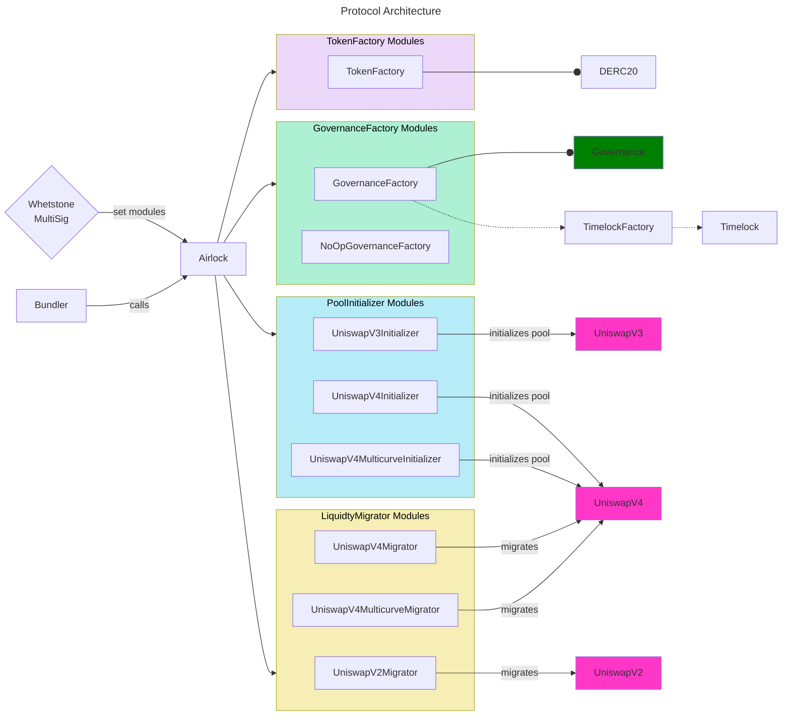

# Airlock

Airlock is a protocol facilitating the deployment of new tokens using a modular approach.

## Architecture

Different types of modules can be used to cover the several aspects of the token lifecycle:

| Module            | Role                                                    |
| ----------------- | ------------------------------------------------------- |
| TokenFactory      | Deploys the tokens                                      |
| GovernanceFactory | Deploys governance and timelock contracts               |
| PoolInitializer   | Initializes a liquidity pool, for example on Uniswap V3 |
| LiquidityMigrator | Migrates liquidity from one pool to another             |

_Note: a "module" must be whitelisted before it can be used._

