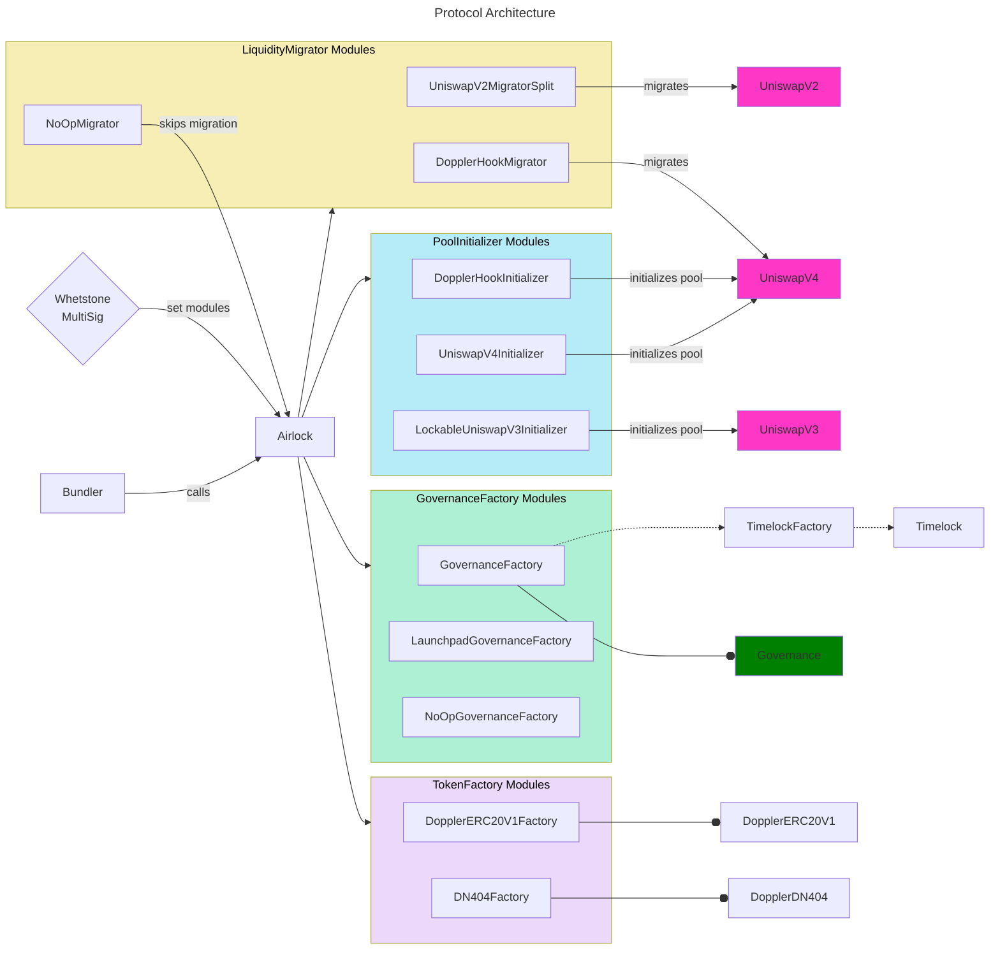

# Airlock

Airlock is a protocol facilitating the deployment of new tokens using a modular approach.

## Architecture

Different types of modules can be used to cover the several aspects of the token lifecycle:

| Module            | Role                                      |
| ----------------- | ----------------------------------------- |
| TokenFactory      | Deploys the tokens                        |
| GovernanceFactory | Deploys governance and timelock contracts |
| PoolInitializer   | Initializes a liquidity pool              |
| LiquidityMigrator | Migrates liquidity after launch           |

_Note: a "module" must be whitelisted before it can be used._

Here is how the different modules interact with the `Airlock` contract:

```mermaid
---
title: Protocol Architecture
---
flowchart LR
    MS{Whetstone<br />MultiSig} --> |set modules|A
    Bundler --> |calls|A

    A[Airlock] --> TFM
    A --> GFM
    A --> LMM
    A --> PIM

    subgraph TFM[TokenFactory Modules]
        DopplerERC20V1Factory
        DN404Factory
    end

    style TFM fill:#ECD9FA, color:#000

    DopplerERC20V1Factory --o DopplerERC20V1
    DN404Factory --o DopplerDN404

    subgraph GFM[GovernanceFactory Modules]
        GovernanceFactory
        LaunchpadGovernanceFactory
        NoOpGovernanceFactory
    end

    style GFM fill:#ADF0D4, color:#000

    GovernanceFactory --o Governance
    GovernanceFactory -.->TimelockFactory
    TimelockFactory -.-> Timelock

    style Governance fill:green

    subgraph PIM[PoolInitializer Modules]
        DopplerHookInitializer
        UniswapV4Initializer
        LockableUniswapV3Initializer
    end

    style PIM fill:#B6ECF7, color:#000

    DopplerHookInitializer --> |initializes pool| UniswapV4
    UniswapV4Initializer --> |initializes pool| UniswapV4
    LockableUniswapV3Initializer --> |initializes pool| UniswapV3

    subgraph LMM[LiquidityMigrator Modules]
        UniswapV2MigratorSplit
        DopplerHookMigrator
        NoOpMigrator
    end

    style LMM fill:#F6EEB4, color:#000

    UniswapV2MigratorSplit --> |migrates| UniswapV2
    DopplerHookMigrator --> |migrates| UniswapV4
    NoOpMigrator --> |skips migration| A

    style UniswapV2 fill:#ff37c7
    style UniswapV3 fill:#ff37c7
    style UniswapV4 fill:#ff37c7
```

## Available Modules

Here is a list of available modules:

| Module                                                                               | Type                | Description                                                                        |
| ------------------------------------------------------------------------------------ | ------------------- | ---------------------------------------------------------------------------------- |
| [DopplerERC20V1Factory](../src/tokens/DopplerERC20V1Factory.sol)                     | `TokenFactory`      | Deploys `DopplerERC20V1` tokens                                                    |
| [DN404Factory](../src/tokens/DN404Factory.sol)                                       | `TokenFactory`      | Deploys `DopplerDN404` tokens                                                      |
| [GovernanceFactory](../src/governance/GovernanceFactory.sol)                         | `GovernanceFactory` | Deploys `Governance` and `Timelock` contracts                                      |
| [LaunchpadGovernanceFactory](../src/governance/LaunchpadGovernanceFactory.sol)       | `GovernanceFactory` | Deploys launchpad governance and timelock contracts                                |
| [NoOpGovernanceFactory](../src/governance/NoOpGovernanceFactory.sol)                 | `GovernanceFactory` | Skips governance deployment                                                        |
| [DopplerHookInitializer](../src/initializers/DopplerHookInitializer.sol)             | `PoolInitializer`   | Initializes a Uniswap V4 multicurve pool with optional external Doppler Hook logic |
| [UniswapV4Initializer](../src/initializers/UniswapV4Initializer.sol)                 | `PoolInitializer`   | Initializes a Uniswap V4 pool with the Doppler auction hook                        |
| [LockableUniswapV3Initializer](../src/initializers/LockableUniswapV3Initializer.sol) | `PoolInitializer`   | Initializes a Uniswap V3 pool and locks liquidity for a defined period             |
| [UniswapV2MigratorSplit](../src/migrators/UniswapV2MigratorSplit.sol)                | `LiquidityMigrator` | Migrates liquidity to a Uniswap V2 pool after a successful auction                 |
| [DopplerHookMigrator](../src/migrators/DopplerHookMigrator.sol)                      | `LiquidityMigrator` | Migrates liquidity to a Uniswap V4 pool with optional external Doppler Hook logic  |
| [NoOpMigrator](../src/migrators/NoOpMigrator.sol)                                    | `LiquidityMigrator` | Skips liquidity migration                                                          |

Documentation for legacy modules has moved to [`legacy/README.md`](../legacy/README.md).
