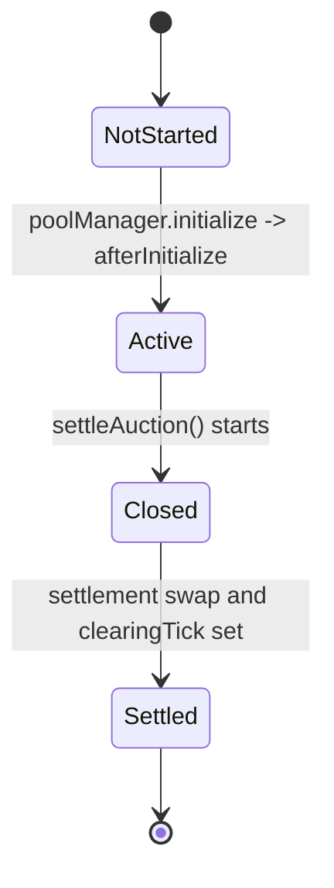
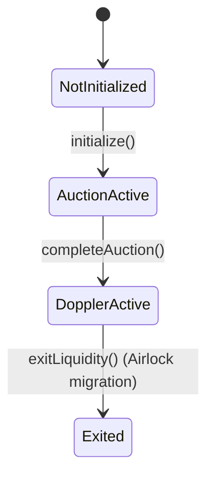
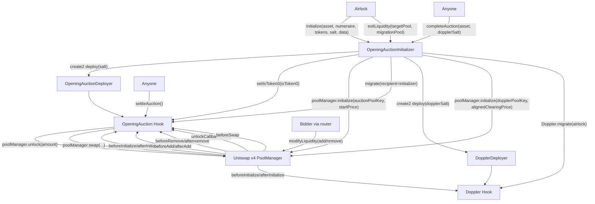
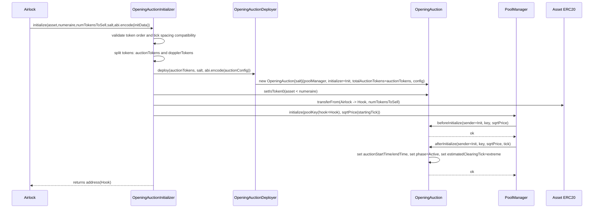
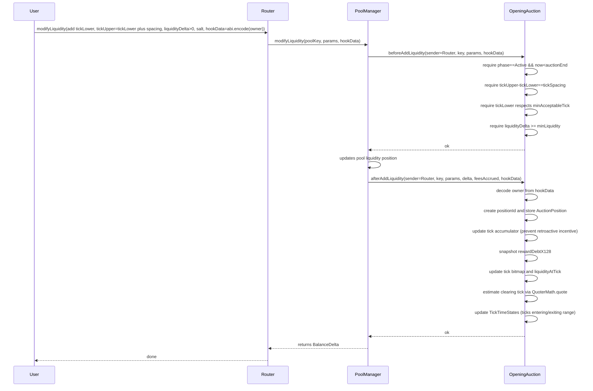
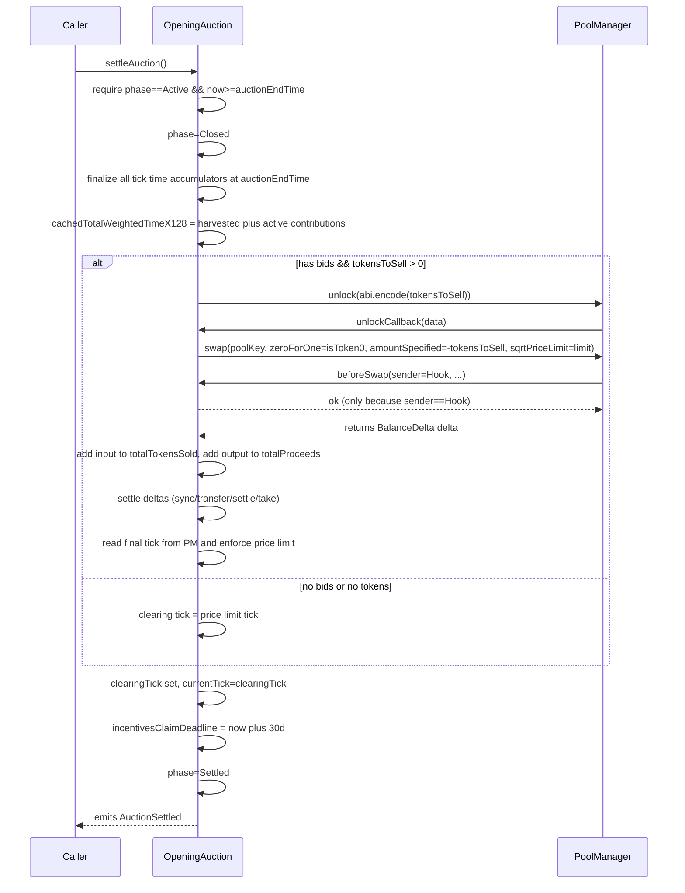
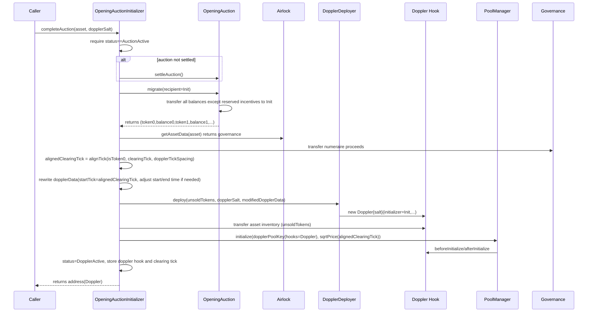

# Opening Auctions Overview

Below is an “everything you need to know” walk-through of the **Opening Auction** system as it’s actually implemented in this repo: architecture, lifecycle, exact hooks + state transitions, and then a **file-by-file deep dive** of every codepath that matters for opening auctions, including the migration into the **Doppler** phase.

I’ll focus on:

* **What the opening auction is** (mechanically) in Uniswap v4 terms
* **Exactly which contracts own which responsibilities**
* **Exactly how bids are represented, tracked, locked, settled**
* **How the clearing tick is estimated and finalized**
* **How incentives are accounted for and claimed**
* **How the initializer migrates to Doppler (and what gets transferred where)**
* **Parameter passing audits** (hookData, token ordering, tick alignment, create2 salts)

---

## Files involved (opening-auction scope)

Core production files:

* `src/initializers/OpeningAuction.sol`
  The **Uniswap v4 hook** implementing the opening auction: bid constraints, clearing-tick estimation, settlement swap, incentive accounting, migration out.

* `src/OpeningAuctionInitializer.sol`
  The **pool initializer** used by Airlock to deploy + initialize the OpeningAuction pool, and later to complete it and transition to Doppler.

* `src/interfaces/IOpeningAuction.sol`
  Public types (config, position structs), errors, events, and public view/external function surface.

Supporting libs used directly by opening auction:

* `src/libraries/QuoterMath.sol`
  View-only swap simulation used to compute **estimated clearing tick**.

* `src/libraries/PoolTickBitmap.sol`
  Helpers used by `QuoterMath` to walk initialized ticks in the pool.

* `src/libraries/TickLibrary.sol`
  Tick alignment utilities used for: starting tick selection and clearing-tick alignment into Doppler.

“Orchestration context” files that are directly relevant to lifecycle:

* `src/Airlock.sol` and `src/base/ImmutableAirlock.sol`
  Airlock calls the initializer and later calls `exitLiquidity`.

Doppler transition context:

* `src/initializers/UniswapV4Initializer.sol` (contains `DopplerDeployer`)
  Create2 deployer for the Doppler hook.

* `src/initializers/Doppler.sol`
  Not the focus, but relevant for the **next phase** and for `exitLiquidity` mechanics.

Deployment script:

* `script/DeployOpeningAuctionInitializer.s.sol`

Tests that encode the intended behavior (worth reading alongside code):

* `test/shared/OpeningAuctionBaseTest.sol` (core harness)
* `test/unit/openingauction/*` (bid constraints, accounting, settlement, migration edge cases)
* `test/integration/OpeningAuction*` (full Airlock + initializer + transition paths)

---

## Big picture: what this “opening auction” really is

### The key idea

The opening auction is implemented as a **Uniswap v4 pool** with a custom hook (`OpeningAuction`), where:

* **Bids** are expressed as **1-tick-wide liquidity positions** (a discrete limit-order-like representation)
* The pool starts at an **extreme price** so that **adding a bid deposits only numeraire**, not the asset
* At settlement time, the hook executes **one real swap**:

  * It sells a fixed amount of the asset (auction allocation minus incentives) into the pool
  * The swap walks across the bid ticks, consuming liquidity, ending at a **clearing price tick**
* The clearing tick represents the price level where the auction’s supply meets the bids.

In parallel, there’s an incentive mechanism:

* A portion of the auction allocation is **reserved as incentive tokens**
* Those incentive tokens are distributed to bidders proportional to:

  * **liquidity** they provided at ticks that were “in range” (i.e., expected to be filled)
  * multiplied by **time** their ticks stayed “in range” during the auction

Then the initializer transitions remaining inventory into Doppler.

---

## Actors and responsibilities

### Airlock (`src/Airlock.sol`)

* Owns the “launch lifecycle”
* Calls `poolInitializer.initialize(...)` during `create(...)`
* Later calls `poolInitializer.exitLiquidity(...)` during migration

### OpeningAuctionInitializer (`src/OpeningAuctionInitializer.sol`)

* Deployed once; used for many assets

* On `initialize(asset, numeraire, numTokensToSell, salt, data)`:

  * Deploys OpeningAuction hook with create2
  * Initializes the Uniswap v4 pool at an extreme tick
  * Transfers tokens from Airlock to the hook

* On `completeAuction(asset, dopplerSalt)`:

  * Ensures the opening auction is settled
  * Pulls proceeds + remaining tokens from the hook (excluding unclaimed incentives)
  * Forwards proceeds to governance
  * Deploys Doppler hook, transfers remaining inventory, initializes Doppler pool at aligned clearing tick

* On `exitLiquidity(...)`:

  * Called by Airlock later, after Doppler phase is active, to migrate liquidity out

### OpeningAuction hook (`src/initializers/OpeningAuction.sol`)

* Enforces all auction rules via v4 hook callbacks:

  * `beforeAddLiquidity`, `afterAddLiquidity`
  * `beforeRemoveLiquidity`, `afterRemoveLiquidity`
  * `beforeSwap` (blocks any swap except settlement)
  * `unlockCallback` (executes settlement swap)
  * `beforeInitialize`, `afterInitialize` (sets auction times, initial ticks)

* Tracks:

  * Bid positions (owner, tick, liquidity, reward-debt)
  * Active ticks bitmap (for O(activeTicks) iteration)
  * Estimated clearing tick (via QuoterMath)
  * Tick “in-range time” accumulators (for incentives)
  * Settlement results (clearingTick, sold, proceeds)
  * Migration state (leaves incentive tokens behind)

---

## Lifecycle state machines

### OpeningAuction (hook) phase machine



Notes:

* `Closed` exists only inside settlement execution to freeze liquidity changes while finalizing times + swapping.
* There is exactly one settlement: after `Settled` it will revert if called again.

### OpeningAuctionInitializer (per-asset) status machine



---

## Architecture diagram: how the pieces connect



---

## The Uniswap v4 “auction mechanics” mapping

### How a “bid” works in this design

A “bid” is a liquidity position `[tickLower, tickUpper)` where:

* `tickUpper - tickLower == tickSpacing` (**exactly one spacing**, enforced)
* Auction pool is initialized at an extreme price:

  * If selling token0 (asset is currency0): start at very high tick near `MAX_TICK`
  * If selling token1 (asset is currency1): start at very low tick near `MIN_TICK`

At those extremes, positions are **completely one-sided**:

* Bidders contribute **only the numeraire side** when adding liquidity
* They do *not* need the asset token to bid

At settlement:

* The hook performs a swap that sells the asset into the pool
* The pool consumes the numeraire liquidity at bid ticks
* The liquidity positions become filled into the asset side

Bidders later withdraw their liquidity to take the purchased asset out of the pool.

---

## Clearing tick concept: “estimated” vs “final”

There are two clearing ticks:

1. **estimatedClearingTick** (dynamic, updated after each bid add)

   * computed by simulating the settlement swap in a view context using `QuoterMath.quote`
   * used to:

     * decide which ticks are **“in range”** (expected to be filled if settled now)
     * lock positions from being removed if they’d be filled
     * drive incentive accrual (time-in-range)

2. **clearingTick** (final, set at settlement)

   * computed from the pool’s actual post-swap tick
   * used after settlement for:

     * `isInRange` queries in settled phase
     * migration start price into Doppler (after alignment)

---

## Sequence diagrams

### 1) Initialization: Airlock creates + initializer deploys hook + pool is initialized



### 2) Bid placement: modifyLiquidity(add) -> hook validates + records bid + updates estimated clearing tick



### 3) Settlement: settleAuction -> finalize time -> unlockCallback -> swap -> set clearingTick



### 4) Completion / transition: completeAuction -> migrate balances -> deploy Doppler -> initialize new pool



---

# How bids, locking, and “in range” really work

This is the critical mental model for this codebase.

## “A bid” = a 1-tick liquidity position

Enforced in `_beforeAddLiquidity`:

* `params.tickUpper - params.tickLower == key.tickSpacing`
  => exactly one tickSpacing wide

This means the auction’s “order book” is a discrete set of tick levels.

## What does “filled” mean?

The hook defines **would this tick be crossed by the settlement swap**.

That logic is:

```solidity
// if selling token0 (tick moves DOWN):
filled(tickLower) := clearingTick < tickUpper

// if selling token1 (tick moves UP):
filled(tickLower) := clearingTick >= tickLower
```

That’s implemented in `_wouldBeFilled(int24 tickLower)`.

Important nuance:

* This is “**touched by the swap path**”, not “final tick ended inside my range”.
* So a tick can be “filled” even if the final tick ended past it.

This is exactly what the unit test `HookPermissionsAndIsInRange.t.sol` asserts.

## Locking rule (during Active phase)

If your position would be filled based on **estimatedClearingTick**, you cannot remove it:

* `_beforeRemoveLiquidity` checks `_wouldBeFilled(pos.tickLower)`
* If true => `PositionLocked()`

This prevents bidders from pulling liquidity that is currently expected to be consumed at settlement.

## Why removal doesn’t recompute estimatedClearingTick

The hook does *not* recompute `estimatedClearingTick` on removals. That’s intentional because:

* It only allows removals when a position is out-of-range per the current estimate
* Removing out-of-range liquidity doesn’t affect the simulated swap result because that swap wouldn’t reach that tick anyway

So recomputing on removal would be wasted gas and complexity.

---

# Incentive system: exact accounting model

## What is incentivized?

A slice of auction tokens is reserved:

```solidity
incentiveTokensTotal = totalAuctionTokens * incentiveShareBps / 10_000;
tokensToSellAtSettlement = totalAuctionTokens - incentiveTokensTotal;
```

These incentives are paid **in the asset token**.

## Who earns incentives?

Positions earn incentives based on **time spent “in range”** (per the evolving `estimatedClearingTick`) multiplied by liquidity.

Intuition:

* If your tick was expected to be filled for longer, you provided “more reliable demand”
* You earn a bigger share of incentives

## Core data structures

Per tick (`tickLower`):

* `TickTimeState { isInRange, lastUpdateTime, accumulatedSecondsX128 }`

Per position:

* `AuctionPosition { owner, tickLower, tickUpper, liquidity, rewardDebtX128, hasClaimedIncentives }`

And global:

* `tickRewardDebtSumX128[tick]` = sum over active positions at that tick of `(pos.rewardDebtX128 * pos.liquidity)`
* `liquidityAtTick[tick]` = sum liquidity at tick
* `positionHarvestedTimeX128[positionId]` = time*liquidity already realized when withdrawing during Active
* `totalHarvestedTimeX128` = sum of harvested across all withdrawn positions
* `cachedTotalWeightedTimeX128` finalized at settlement

## MasterChef-style math: why reward debt exists

Tick accumulators are time-only; they don’t know when a position joined.

If you naively used:

`tick.accumulatedSecondsX128 * position.liquidity`

then someone joining late would get credit for earlier time.

So instead:

* On add: snapshot `rewardDebtX128 = tick.accumulatedSecondsX128`
* For active positions, earned contribution is:

`(tick.accumulatedSecondsX128 - rewardDebtX128) * liquidity`

And the sum across positions at a tick can be computed efficiently as:

`gross = tick.accumulatedSecondsX128 * totalLiquidityAtTick`
`debt  = tickRewardDebtSumX128[tick]`
`activeContribution = gross - debt` (if gross > debt)

## Final denominator

At settlement, `_finalizeAllTickTimes()` computes:

```solidity
cachedTotalWeightedTimeX128 =
  totalHarvestedTimeX128
  + Σ_over_active_ticks (tick.accumulatedSecondsX128 * liquidityAtTick[tick] - tickRewardDebtSumX128[tick])
```

After settlement, claims are O(1) using this cached denominator.

## Claim amount

For a position:

```solidity
earnedTimeX128 =
  positionHarvestedTimeX128[positionId]
  + (tickAccumulatorX128(tickLower) - pos.rewardDebtX128) * pos.liquidity

incentives = incentiveTokensTotal * earnedTimeX128 / cachedTotalWeightedTimeX128
```

Claim window:

* set at settlement: `incentivesClaimDeadline = block.timestamp + 30 days`

---

# Migration to Doppler: what transfers and what doesn’t

This is a super important “who holds what tokens when” story.

## Token custody over time

### Immediately after `OpeningAuctionInitializer.initialize`

* **OpeningAuction hook holds**:

  * `auctionTokens` (which include incentive slice)
  * `dopplerTokens` (not sold in opening auction)
* **Pool** holds bidder-provided numeraire (as liquidity positions)
* **No swap occurs yet**

### After settlement swap (`OpeningAuction.settleAuction`)

* The hook sold `auctionTokens - incentives` into the pool
* The hook received **numeraire proceeds**
* Bidders now effectively own purchased asset **inside their liquidity positions**
* The hook still holds:

  * `incentiveTokensTotal` (reserved)
  * `dopplerTokens`
  * any unsold auction tokens (if price limit hit / insufficient liquidity)

### On `completeAuction`

Initializer calls `OpeningAuction.migrate(recipient=initializer)`.

**What migrate transfers out:**

* all hook balances of token0/token1 **minus reserved incentives**

Reserved incentives are:

`reservedIncentives = incentiveTokensTotal - totalIncentivesClaimed`

So migrate transfers:

* **proceeds numeraire** (entirely transferable)
* **asset inventory** excluding **unclaimed incentives**

  * this includes dopplerTokens + unsold auction tokens

**What stays inside OpeningAuction hook:**

* unclaimed incentives only

Then initializer:

* forwards proceeds to governance
* transfers remaining asset inventory to Doppler hook
* initializes Doppler pool at aligned clearing tick

Users can still claim incentives from the OpeningAuction hook even after the system moved on to Doppler.

---

# File-by-file breakdown

## 1) `src/interfaces/IOpeningAuction.sol`

### Key structs

* `OpeningAuctionConfig`
  Fields used by **OpeningAuction hook**:

  * `auctionDuration`
  * `minAcceptableTickToken0`
  * `minAcceptableTickToken1`
  * `incentiveShareBps`
  * `tickSpacing`
  * `fee`
  * `minLiquidity`

  Field used by **initializer** (not by hook):

  * `shareToAuctionBps`

* `AuctionPosition`

  * `owner`
  * `tickLower`, `tickUpper`
  * `liquidity` (uint128)
  * `rewardDebtX128`
  * `hasClaimedIncentives`

* `TickTimeState`

  * `isInRange`
  * `lastUpdateTime`
  * `accumulatedSecondsX128`

### Key enums

* `AuctionPhase { NotStarted, Active, Closed, Settled }`

### Key public functions (implemented in `OpeningAuction.sol`)

* `settleAuction()`
* `claimIncentives(positionId)`
* `migrate(recipient)`
* `calculateIncentives(positionId)`
* `positions(positionId)`
* `isInRange(tickLower)`
* `isPositionLocked(positionId)`
* tick helpers like `getPositionId(...)`

### Important to notice

The interface’s semantics match the hook code:

* “in range” is defined by `estimatedClearingTick` during `Active/Closed`, and by `clearingTick` after `Settled`.

---

## 2) `src/initializers/OpeningAuction.sol` — the hook implementation

I’m going to break this down by responsibility area.

---

### A) Construction + config validation

Constructor stores:

* `initializer` (address)
* `auctionDuration`
* `minAcceptableTickToken0`, `minAcceptableTickToken1`
* `totalAuctionTokens`
* `incentiveTokensTotal`
* `minLiquidity`

And validates:

* `auctionDuration > 0`
* `incentiveShareBps <= 10_000`
* `tickSpacing > 0`
* minAcceptable ticks are:

  * multiples of tickSpacing
  * within Uniswap tick bounds
* `fee <= 1_000_000` (v4 fee units)
* `minLiquidity > 0`

Note the constructor does **not** set `poolKey` or start times; that happens on pool initialize callbacks.

---

### B) Hook permissions (critical for v4)

`getHookPermissions()` returns a `Hooks.Permissions` struct enabling:

* initialize hooks: `beforeInitialize`, `afterInitialize`
* liquidity hooks: `beforeAddLiquidity`, `afterAddLiquidity`, `beforeRemoveLiquidity`, `afterRemoveLiquidity`
* swap hook: `beforeSwap` (used to block any swaps except settlement)
* unlock hook: `unlockCallback` (used to perform settlement swap)

Everything else is false.

This is why the hook must be deployed at an address whose low bits encode those flags (tests mine a salt to get such an address).

---

### C) isToken0 handshake (CRITICAL to ordering)

The hook needs to know whether it’s “selling token0” or “selling token1”.

It uses:

* `bool public isToken0;`
* `bool public isToken0Set;`

`setIsToken0(bool)`:

* only callable by `initializer`
* sets `isToken0` and `isToken0Set = true`

Then `_beforeInitialize` requires `isToken0Set`, otherwise reverts `IsToken0NotSet()`.

**Parameter audit:**
`OpeningAuctionInitializer.initialize` always does:

* derive `isToken0 = asset < numeraire`
* call `auctionHook.setIsToken0(isToken0)`
* build poolKey with currency0/1 consistent with that ordering

So hook and poolKey remain consistent.

---

### D) Pool initialization callbacks

#### `_beforeInitialize(sender, key, sqrtPriceX96)`

Enforces:

* `sender == initializer`
* `isToken0Set == true`

Then stores:

* `poolKey = key`

This is the hook’s “bind me to this pool” moment.

#### `_afterInitialize(sender, key, sqrtPriceX96, tick)`

Enforces:

* only run once (`isInitialized` guard)

Then sets:

* `auctionStartTime = block.timestamp`
* `auctionEndTime = start + auctionDuration`
* `currentTick = tick`
* `estimatedClearingTick = isToken0 ? MAX_TICK : MIN_TICK`
* `phase = Active`

Also emits `AuctionStarted(start, end)`.

**Note**: initial `estimatedClearingTick` is extreme on purpose; it means “nothing is in range yet” until bids exist and the estimate is recomputed.

---

### E) Bid placement constraints (beforeAddLiquidity)

`_beforeAddLiquidity(..., params, hookData)` checks:

1. Auction must be active and not ended:

   * `phase == Active`
   * `block.timestamp < auctionEndTime`
2. Must be a single tick range:

   * `tickUpper - tickLower == tickSpacing`
3. Must meet minimum acceptable price:

   * `tickLower` compared against `_auctionPriceLimitTick()`
4. Must be >= `minLiquidity`
5. Must include hookData owner:

   * `_decodeOwner(hookData)` must succeed

The min price enforcement is **direction-aware**:

* `_auctionPriceLimitTick()` returns:

  * if selling token0: `minAcceptableTickToken0`
  * if selling token1: `-minAcceptableTickToken1` (because tick is inverted when swapping token1)

**Parameter audit:**

* The config stores both `minAcceptableTickToken0` and `minAcceptableTickToken1`
* The hook uses the correct one depending on `isToken0`

---

### F) Bid recording + clearing tick update (afterAddLiquidity)

`_afterAddLiquidity(... params, delta, hookData)` does the real work:

1. Decode owner from hookData

2. Compute `positionKey = keccak256(abi.encodePacked(owner, tickLower, tickUpper, salt))`

3. Enforce uniqueness:

   * if `positionKeyToId[key]` exists and `_positions[id].liquidity != 0` => `PositionAlreadyExists()`

4. Create a new `positionId`:

   * `positionId = nextPositionId++`
   * store `AuctionPosition` with owner + tick range + liquidity

5. Update tick accumulator **before** setting reward debt:

   * `_updateTickAccumulator(tickLower)`
     ensures the tick accumulator includes all time up to now for existing positions

6. Snapshot rewardDebt:

   * `rewardDebtX128 = tickTimeStates[tickLower].accumulatedSecondsX128`

7. Add to tick-level debt sum:

   * `tickRewardDebtSumX128[tickLower] += rewardDebtX128 * liquidity`

8. Update tick liquidity + bitmap:

   * if tick was previously empty => `_insertTick(tickLower)`
   * `liquidityAtTick[tickLower] += liquidity`

9. Update `estimatedClearingTick`:

   * `_updateClearingTickAndTimeStates()`

     * uses `QuoterMath.quote` to compute tick after simulated swap
     * floors it to tickSpacing
     * updates tick in-range states (enter/exit range)
     * emits `EstimatedClearingTickUpdated(old,new)`

10. Special-case: ensure this newly-added tick is marked in-range if now fillable

    * if `_wouldBeFilled(pos.tickLower)` and tickState.isInRange was false:

      * tickState.lastUpdateTime = now
      * tickState.isInRange = true
      * emit `TickEnteredRange`

11. Emit `BidPlaced(...)`

---

### G) Partial removal is forbidden during Active (beforeRemove + afterRemove)

`_beforeRemoveLiquidity` behavior:

* If phase is **Closed**: revert `AuctionNotActive()`
* If phase is **Settled**: allow removal (no restrictions)
* If phase is **Active**:

  1. decode owner, compute positionKey, look up positionId
  2. require position exists and liquidity > 0
  3. disallow partial removal:

     * `params.liquidityDelta` must not be “less negative” than full removal
  4. disallow removing locked positions:

     * if `_wouldBeFilled(pos.tickLower)` => `PositionLocked()`

`_afterRemoveLiquidity` only runs accounting **during Active**:

* updates tick accumulator
* subtracts from tickRewardDebtSumX128
* subtracts liquidityAtTick and remove tick from bitmap if zero
* harvests the position’s earned time into `positionHarvestedTimeX128`
* sets pos.liquidity = 0 and deletes the positionKey mapping

After settlement, the hook intentionally stops tracking removals, because:

* incentive accounting is already frozen
* allowing removals without extra book-keeping keeps post-auction UX normal

---

### H) “In range” and tick-time state transitions

The hook maintains tick-level time accounting only for ticks that become “in range” according to the evolving **estimatedClearingTick**.

Two main operations:

#### 1) Updating estimated clearing tick

`_updateClearingTick()`:

* calls `_calculateEstimatedClearingTick()`:

  * simulates swap of `totalAuctionTokens - incentiveTokensTotal`
  * uses sqrtPrice limit derived from min acceptable tick
* floors the tick result to tickSpacing using `_floorToSpacing()`

#### 2) Applying “range” changes

`_updateTickTimeStates(oldTick, newTick)`:

* if clearing tick moved:

  * figure out which ticks newly entered range
  * which newly exited range
* for each tick entering:

  * set `isInRange = true`
  * set `lastUpdateTime = now`
* for each tick exiting:

  * call `_updateTickAccumulator(tick)` first (captures time until now/end)
  * set `isInRange = false`

This uses the hook’s own active-ticks bitmap so it iterates over **only ticks that have liquidity**, not the entire tick space.

---

### I) Settlement swap: the only allowed swap

Two mechanisms enforce “no swaps during auction except settlement”.

1. `_beforeSwap(sender, ...)`:

* if `sender != address(this)` => revert `AuctionSwapDisabled()`

So only the hook itself can trigger swaps.

2. Settlement swap is executed only via `unlockCallback`.

#### settleAuction()

* can be called by anyone
* requires `phase == Active` and `now >= auctionEndTime`
* sets `phase = Closed` immediately (freezes further changes)
* calls `_finalizeAllTickTimes()` (caches incentive denominator)
* if has bids and tokensToSell > 0:

  * `_executeSettlementSwap(tokensToSell)` -> `poolManager.unlock(abi.encode(amount))`
* sets `clearingTick`:

  * if swap happened => final tick from pool state
  * else => price limit tick
* sets claim deadline: `now + 30 days`
* sets `phase = Settled`
* emits `AuctionSettled(...)`

#### unlockCallback(data)

* only callable by poolManager (enforced)
* decodes amountToSell
* calls `poolManager.swap(...)` with:

  * `zeroForOne = isToken0`
  * `amountSpecified = -amountToSell` (exact input)
  * `sqrtPriceLimitX96 = _sqrtPriceLimitX96()`

Then:

* updates `totalTokensSold`, `totalProceeds` from returned delta
* settles owed currency to poolManager (sync/transfer/settle)
* takes owed currency from poolManager (take)
* checks final tick does not violate limit

---

### J) Migration out of the hook (into the initializer)

`migrate(recipient)`:

* only callable by initializer
* only in `phase == Settled`
* computes reserved incentives remaining:

  * `reserved = incentiveTokensTotal - totalIncentivesClaimed`
* transfers all hook-held balances **except reserved incentives**
* sets `isMigrated = true`
* returns a tuple shaped like the v4 migrator expectations:

  * sqrtPriceX96, token0/1 addresses, “fees” (0), balances

This is what makes `completeAuction` possible while still letting incentives be claimed later.

---

### K) Incentives claim + recover + sweep

* `claimIncentives(positionId)`:

  * only `phase == Settled`
  * only before `incentivesClaimDeadline`
  * anyone can call, but funds go to `pos.owner`
  * sets `pos.hasClaimedIncentives = true`
  * increments `totalIncentivesClaimed`

* `recoverIncentives(recipient)`:

  * only initializer
  * only after `isMigrated`
  * only if `cachedTotalWeightedTimeX128 == 0`
  * transfers all incentive tokens out (because nobody earned any)

* `sweepUnclaimedIncentives(recipient)`:

  * only initializer
  * only after `isMigrated`
  * only after claim deadline
  * transfers remaining (including “dust” from rounding)
  * then sets `incentiveTokensTotal = totalIncentivesClaimed` so reserved becomes zero

---

## 3) `src/OpeningAuctionInitializer.sol` — initializer + transition coordinator

This contract is where “opening auction as a product” becomes real.

It is called by Airlock and owns:

* deployment of the hook
* pool initialization
* per-asset state tracking
* transition to Doppler
* exitLiquidity integration with Airlock

### Key state

Per asset:

```solidity
mapping(address => OpeningAuctionState) public getState;
```

`OpeningAuctionState` includes:

* `numeraire`
* `auctionStartTime`, `auctionEndTime`
* `auctionTokens` and `dopplerTokens`
* `status` (NotInitialized / AuctionActive / DopplerActive / Exited)
* `openingAuctionHook`
* `dopplerHook`
* `openingAuctionPoolKey`
* `dopplerInitData` (bytes)
* `isToken0`
* and later `clearingTick`, etc.

Also reverse lookups for exitLiquidity:

* `mapping(address => address) public dopplerHookToAsset;`
* `mapping(address => address) public openingAuctionHookToAsset;`

This is a key integration detail: Airlock’s “pool address” is the hook address, so `exitLiquidity` may be called with either.

---

### A) initialize(...) (Airlock entrypoint)

Signature:

```solidity
function initialize(
  address asset,
  address numeraire,
  uint256 numTokensToSell,
  bytes32 salt,
  bytes calldata data
) external onlyAirlock returns (address pool);
```

Steps:

1. Ensure this asset isn’t already initialized

2. Decode `data` as:

```solidity
OpeningAuctionInitData {
  OpeningAuctionConfig auctionConfig;
  bytes dopplerData;
}
```

3. Validate token order:

* asset and numeraire are nonzero and not equal
* `isToken0 = asset < numeraire`

4. Validate Doppler configuration matches this token ordering:

* `_extractDopplerIsToken0(dopplerData)` must equal `isToken0`
* otherwise `IsToken0Mismatch()`

5. Validate tick spacing compatibility:

* extract Doppler `tickSpacing` from dopplerData
* require: `auctionConfig.tickSpacing % dopplerTickSpacing == 0`
* otherwise `IncompatibleTickSpacing()`

6. Split inventory:

* `auctionTokens = numTokensToSell * shareToAuctionBps / 10_000`
* if auctionTokens == 0 => `AuctionAllocationTooSmall()`
* `dopplerTokens = numTokensToSell - auctionTokens`

7. Deploy opening auction hook via `OpeningAuctionDeployer.deploy(...)`:

* `OpeningAuctionDeployer.deploy(auctionTokens, salt, abi.encode(auctionConfig))`
* the deployer sets initializer = `msg.sender` (this initializer)

8. Store state and reverse mappings:

* `state.openingAuctionHook = hook`
* `openingAuctionHookToAsset[hook] = asset`
* store `dopplerInitData = initData.dopplerData`

9. Set isToken0 in hook:

* `auctionHook.setIsToken0(isToken0)`

10. Transfer tokens from Airlock to the hook:

* `IERC20(asset).transferFrom(airlock, hook, numTokensToSell)`

11. Initialize the Uniswap v4 pool:

* build `PoolKey` with:

  * currency0/currency1 determined by isToken0
  * `fee = auctionConfig.fee`
  * `tickSpacing = auctionConfig.tickSpacing`
  * `hooks = hook`
* choose starting tick:

  * `TickLibrary.alignTickTowardZero(MAX_TICK or MIN_TICK, tickSpacing)`
* call `poolManager.initialize(poolKey, sqrtPrice(startTick))`

12. Emit `AuctionInitialized(...)` and return hook address.

**Parameter audit highlights**

* `OpeningAuctionDeployer` passes `initializer = msg.sender` into the hook constructor => initializer-only functions line up
* `auctionTokens` is passed as `totalAuctionTokens_` into hook, matching incentive calculations
* `numTokensToSell` includes dopplerTokens which are intentionally held by hook until migration

---

### B) completeAuction(asset, dopplerSalt) (permissionless transition)

This is the bridge from opening auction -> Doppler.

Steps:

1. Load state, require `status == AuctionActive`

2. Get opening auction hook

3. If not settled:

* `auctionHook.settleAuction()`

4. Read:

* `clearingTick = auctionHook.clearingTick()`
* `proceeds = auctionHook.totalProceeds()`

5. Pull balances out of auction hook:

* `auctionHook.migrate(address(this))`

  * transfers **proceeds + remaining inventory** excluding unclaimed incentives
  * returns token0/token1/balances

6. Determine:

* `unsoldTokens` (asset side balance)
* `numeraireBalance` (proceeds)

7. Forward proceeds to governance:

* `airlock.getAssetData(asset)` => governance
* transfer `numeraireBalance` to governance

8. Align clearing tick for Doppler:

* `dopplerTickSpacing = extract from dopplerInitData`
* `alignedClearingTick = TickLibrary.alignTick(isToken0, clearingTick, dopplerTickSpacing)`
* clamp to min/max aligned ticks

9. Rewrite doppler init data:

* set startingTick to `alignedClearingTick`
* if current time >= doppler startingTime in data:

  * shift start to `now + 1`
  * keep same duration by shifting end

10. Deploy Doppler hook:

* `doppler = dopplerDeployer.deploy(unsoldTokens, dopplerSalt, modifiedDopplerData)`
* store `dopplerHookToAsset[doppler] = asset`

11. Transfer inventory to Doppler:

* transfer `unsoldTokens` asset into doppler contract

12. Initialize Doppler pool:

* new PoolKey:

  * same currency0/currency1 as opening auction pool key
  * `tickSpacing = dopplerTickSpacing`
  * `fee = LPFeeLibrary.DYNAMIC_FEE_FLAG`
  * `hooks = doppler`
* poolManager.initialize at `alignedClearingTick`

13. Update state:

* `status = DopplerActive`
* store dopplerHook and clearing tick
* emit `AuctionCompleted(...)`

**Parameter audit highlights**

* `alignedClearingTick` is used both:

  * in dopplerData (startingTick field)
  * and as pool initialization sqrtPrice
    => keeps Doppler internal assumptions consistent

* `dopplerDeployer.deploy(... initializer=msg.sender)` ensures:

  * Doppler.initializer == OpeningAuctionInitializer
  * later `exitLiquidity` can call `Doppler.migrate(...)`

---

### C) exitLiquidity(...) (Airlock migration integration)

Signature:

```solidity
function exitLiquidity(
  address sender,
  address target,
  address migrationPool,
  bytes calldata data
) external onlyAirlock returns (...)
```

It supports two “target” addresses:

* If `target` is a Doppler hook:

  * `asset = dopplerHookToAsset[target]`
* Else if `target` is an OpeningAuction hook:

  * `asset = openingAuctionHookToAsset[target]`
* Else revert `UnknownTarget()`

Then:

* require `state.status == DopplerActive`
* call `Doppler(target).migrate(address(airlock))`
* set `status = Exited`
* emit `AuctionExited(...)`

This is specifically covered by integration test `OpeningAuctionAirlockExitLiquidity.t.sol`.

---

### D) Incentive management wrappers

These can only be called by Airlock:

* `recoverOpeningAuctionIncentives(asset, recipient)` calls hook `recoverIncentives`
* `sweepOpeningAuctionIncentives(asset, recipient)` calls hook `sweepUnclaimedIncentives`

---

### E) Doppler data decoding helpers (very important)

The initializer assumes dopplerData is encoded as:

```solidity
abi.encode(
  uint256 minimumProceeds,
  uint256 maximumProceeds,
  uint256 startingTime,
  uint256 endingTime,
  int24 startingTick,
  int24 endingTick,
  uint256 epochLength,
  int24 gamma,
  bool isToken0,
  uint256 numPDSlugs,
  uint24 lpFee,
  int24 tickSpacing
)
```

* `_extractDopplerTickSpacing(dopplerData)` returns the last `int24`
* `_extractDopplerIsToken0(dopplerData)` returns the `bool isToken0`
* `_encodeDopplerDataWithNewStart(...)` decodes, overwrites time/tick, re-encodes

**Parameter audit risk to watch:**
If a caller supplies dopplerData not matching this layout, decoding will revert.

---

## 4) `src/libraries/QuoterMath.sol` — estimated clearing tick simulation

This is used **only** for:

* computing `estimatedClearingTick` dynamically during bidding

The hook calls:

```solidity
QuoterMath.quote(poolManager, poolKey, SwapParams({
  zeroForOne: isToken0,
  amountSpecified: -int256(tokensToSell),
  sqrtPriceLimitX96: _sqrtPriceLimitX96()
}))
```

`quote` re-implements core swap stepping logic in **view** form:

* reads slot0 (sqrtPrice, tick)
* reads current liquidity
* iteratively:

  * finds next initialized tick (via poolManager)
  * computes swap step using swap math and fee
  * crosses ticks and updates liquidity net
* returns final sqrtPrice and tick after the simulated swap

The opening auction uses only `tickAfter`, then floors it to tickSpacing.

This is what makes:

* “is your position in range?”
* “is your position locked?”
* “do ticks enter/exit range for incentives?”
  work during the auction *without executing any swaps*.

---

## 5) `src/libraries/PoolTickBitmap.sol` — helper for `QuoterMath`

This library provides bitmap walking logic for pool ticks.

`QuoterMath` relies on poolManager methods that expose:

* `getNextInitializedTickWithinOneWord(...)`
* and tick/bitmap information for the core pool

This is separate from OpeningAuction’s own tick bitmap:

* poolManager’s tick bitmap = actual v4 pool’s liquidity ticks
* OpeningAuction’s internal bitmap = only for incentive accounting iteration

---

## 6) `src/libraries/TickLibrary.sol` — tick alignment utilities

Two important functions used in opening auctions:

### `alignTickTowardZero(tick, spacing)`

Used for initial pool tick choice near extremes:

* aligns `MIN_TICK` or `MAX_TICK` to a valid tick multiple toward 0

### `alignTick(isToken0, tick, spacing)`

Used when migrating into Doppler:

* if `isToken0 == true` => floor tick (toward -infinity)
* else => ceil tick (toward +infinity)

This makes Doppler start at a tick aligned to its spacing **without starting at a “better” price than the opening auction’s clearing tick**.

---

## 7) `src/Airlock.sol` + `src/base/ImmutableAirlock.sol`

`OpeningAuctionInitializer` uses `ImmutableAirlock` so:

* `initialize(...)` is callable only by Airlock
* same for `exitLiquidity` and incentive wrapper methods

Airlock calls `poolInitializer.initialize(...)` during `create(...)`, stores returned pool address (hook address) as the asset’s pool.

Later, Airlock calls `poolInitializer.exitLiquidity(...)` as part of the overall migration pipeline.

---

## 8) Doppler transition context

### `src/initializers/UniswapV4Initializer.sol` (`DopplerDeployer`)

The initializer uses this deployer in `completeAuction`:

* create2 deploy the Doppler hook at a salt
* initializer becomes Doppler’s `initializer` address (msg.sender)
* Doppler gets `numTokensToSell = unsoldTokens` and the other decoded config values

### `src/initializers/Doppler.sol`

Not an opening-auction file, but relevant because:

* it has `migrate(...)` callable only by its initializer
* it’s what `exitLiquidity` calls later

---

# Parameter passing audit (key interactions)

Here’s the “make sure functions are passing what they expect” checklist, with the exact expectations.

## 1) `OpeningAuctionInitializer.initialize` → `OpeningAuctionDeployer.deploy`

* **Passes**

  * `auctionTokens` (NOT total tokens) as `totalAuctionTokens_` into hook constructor
  * `data = abi.encode(OpeningAuctionConfig)`
* **Expected by deployer**

  * `abi.decode(data, (OpeningAuctionConfig))` succeeds
* **Result**

  * Hook computes `incentiveTokensTotal` from `auctionTokens`

✅ Correct: dopplerTokens are held by hook balance but not part of `totalAuctionTokens`.

## 2) Initializer → Hook: `setIsToken0(isToken0)`

* **Passes** `isToken0 = (asset < numeraire)`
* Hook requires `isToken0Set` before pool initialization.

✅ Correct and essential: prevents the “wrong token orientation” bug (see `TokenOrdering.t.sol`).

## 3) Initializer → poolManager.initialize(poolKey, sqrtPrice)

* poolKey uses:

  * currency ordering consistent with isToken0 and address order
  * `fee = auctionConfig.fee`
  * `tickSpacing = auctionConfig.tickSpacing`
  * `hooks = openingAuctionHook`

✅ Correct: hook stores this poolKey in `_beforeInitialize`.

## 4) Bids: user/router → modifyLiquidity(params, hookData)

Hook expects hookData to contain an **owner address**:

* accepted forms:

  * `abi.encode(owner)` (>= 32 bytes)
  * `abi.encodePacked(owner)` (20 bytes)

If hookData missing/short => `MissingHookData()`.

✅ Correct: tests cover both formats (`HookDataDecoding.t.sol`).

## 5) Remove liquidity (Active): must be full removal

* `_beforeRemoveLiquidity` enforces non-partial removal (and out-of-range)
* `_afterRemoveLiquidity` enforces exact full removal

✅ Correct: prevents partial-removal accounting exploits (`PartialRemoval.t.sol`).

## 6) Settlement swap: only hook can swap

* Hook calls `poolManager.swap(...)` from within `unlockCallback`
* `_beforeSwap(sender, ...)` checks `sender == address(this)`

✅ Correct: blocks all external swaps during auction (`BeforeSwap.t.sol`).

## 7) Migration: initializer calls `OpeningAuction.migrate(recipient)`

* Hook requires `msg.sender == initializer`
* Transfers out balances excluding reserved incentives

✅ Correct: leaves incentives behind and supports late claims.

## 8) Doppler deployment + initialization

* `alignedClearingTick` is written into dopplerData AND used to initialize pool

✅ Correct: keeps Doppler state consistent.

## 9) `exitLiquidity(target=hookAddress)`

Initializer supports:

* Doppler hook targets
* OpeningAuction hook targets (reverse mapping)

✅ Correct: fixes integration edge (`OpeningAuctionAirlockExitLiquidity.t.sol`).

---

# Test suite map (what each opening-auction test proves)

This is useful as an “executable spec”:

* **Hook data / ownership**

  * `HookDataDecoding.t.sol`: owner decoding formats

* **Bid constraints**

  * `BeforeAddLiquidity.t.sol`: time gating and phase restrictions
  * `TokenOrdering.t.sol`: isToken0 correctness
  * `PartialRemoval.t.sol`: disallow partial removals in Active
  * `PositionTracking.t.sol`: position uniqueness via (owner,tick,salt)

* **Range tracking**

  * `DynamicRangeTracking.t.sol`: estimated clearing tick updates, ticks enter/exit range correctly
  * `TickBitmap.t.sol`: internal active tick bitmap correctness
  * `ClearingTickAlignment.t.sol`: estimated tick flooring to spacing

* **Swap restrictions / settlement**

  * `BeforeSwap.t.sol`: block external swaps
  * `Settlement.t.sol`: settlement sets claim deadline based on settlement time

* **Incentives**

  * `Incentives.t.sol`: incentives computed from earned time; zero before time accrues
  * `IncentiveRecovery.t.sol`: recover/sweep paths, dust behavior

* **Initializer + transition**

  * `OpeningAuctionInitializer.t.sol`: initialization, completion, salt mining patterns
  * `OpeningAuctionInitializerTickAlignment.t.sol`: tick alignment into Doppler
  * `InitializerTickSpacing.t.sol`: tickSpacing compatibility enforcement

* **Integration**

  * `OpeningAuctionAirlockExitLiquidity.t.sol`: Airlock -> exitLiquidity works on both hook targets

---

# Practical usage patterns (solidity-esque pseudocode)

## Deploy / create via Airlock

```solidity
OpeningAuctionConfig memory cfg = OpeningAuctionConfig({
  auctionDuration: 3 days,
  minAcceptableTickToken0: -34_020,
  minAcceptableTickToken1: -34_020,
  incentiveShareBps: 1_000,
  tickSpacing: 60,
  fee: 3_000,
  minLiquidity: 1e15,
  shareToAuctionBps: 7_000
});

bytes memory dopplerData = abi.encode(
  minProceeds,
  maxProceeds,
  startingTime,
  endingTime,
  int24(0),         // startingTick overwritten later
  endingTick,
  epochLength,
  gamma,
  isToken0,         // MUST match asset<numeraire
  numPDSlugs,
  lpFee,
  dopplerTickSpacing
);

bytes memory initData = abi.encode(OpeningAuctionInitData({
  auctionConfig: cfg,
  dopplerData: dopplerData
}));

airlock.create(
  /* asset params */,
  address(openingAuctionInitializer),
  /* poolInitializerData = */ initData,
  /* salt = */ openingAuctionHookSalt,
  /* ... */
);
```

## Place a bid (via a router that calls PoolManager.modifyLiquidity)

```solidity
ModifyLiquidityParams memory p = ModifyLiquidityParams({
  tickLower: bidTick,
  tickUpper: bidTick + tickSpacing,
  liquidityDelta: int256(uint256(liquidity)),
  salt: mySalt
});

bytes memory hookData = abi.encode(myAddress);

router.modifyLiquidity(poolKey, p, hookData);
```

## Settle after the auction ends

```solidity
openingAuction.settleAuction();
```

## Claim incentives

```solidity
openingAuction.claimIncentives(positionId);
```

## Transition to Doppler (permissionless)

```solidity
openingAuctionInitializer.completeAuction(asset, dopplerSalt);
```

---

# Gotchas / non-obvious behaviors you should internalize

1. **Positions are not “topped up.”**
   Adding liquidity to the same (owner,tickLower,tickUpper,salt) again will revert `PositionAlreadyExists`.
   You must use a new salt for each additional bid even at the same tick.

2. **The hook’s “owner” is purely from hookData.**
   The hook does not trust/assume `sender` from PoolManager.
   This is essential for routers, but it means your periphery must pass consistent hookData on remove as well.

3. **Locking depends on estimatedClearingTick, not final.**
   Positions can become unlocked if later bids move the clearing tick away from them.

4. **Settlement swap is the only swap.**
   Any attempt to swap through that pool during auction reverts.

5. **CompleteAuction can be called while incentive claims are still open.**
   That’s intended: migration excludes unclaimed incentives.

6. **If no one earned any time-in-range**, incentives would be stuck unless recovered.
   That’s why `recoverIncentives` exists (only for cachedTotalWeightedTime==0).

---

If you want, paste (or point me to) the exact **deployment/config** you’re using (tickSpacing, minAcceptable ticks, incentiveShareBps, shareToAuctionBps, and the dopplerData tuple), and I can also:

* sanity-check the tick math and sign conventions for your specific token ordering,
* produce a “price-path diagram” showing exactly which ticks would be crossed for your current bids,
* and walk through the exact storage updates for a concrete example (two bids enter range, one exits, then settlement).

