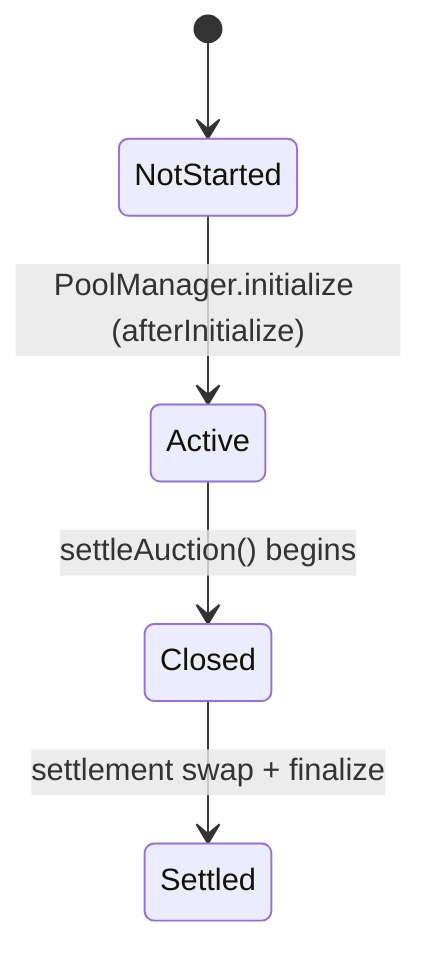
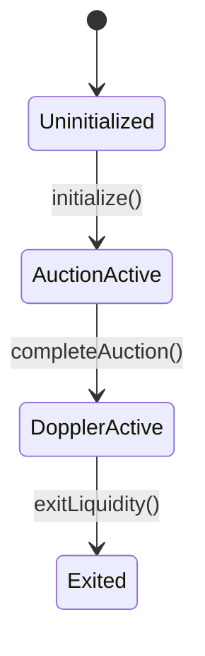

# Opening Auction Technical Specification (Audit-Focused)

This document is the canonical technical reference for the **Opening Auction** implementation in this repository.
It is written for auditors and protocol engineers and aims to describe:

- The exact on-chain components involved
- All state, data layouts, and encodings
- The full lifecycle (creation -> bidding -> settlement -> migration -> exit)
- All validations, constraints, and invariants
- Where each invariant is tested

The implementation is built on **Uniswap v4** and uses a **hook-based, single-swap batch auction** where bids are represented as one-tick liquidity positions.

---

## Contents

- [Terminology](#terminology)
- [High-level design](#high-level-design)
- [On-chain components](#on-chain-components)
- [Configuration and initialization data](#configuration-and-initialization-data)
- [State machines](#state-machines)
- [Token custody and flows](#token-custody-and-flows)
- [OpeningAuction hook](#openingauction-hook)
  - [Hook permissions and address constraints](#hook-permissions-and-address-constraints)
  - [Storage layout](#storage-layout)
  - [Views and helpers](#views-and-helpers)
  - [Bidding: add liquidity](#bidding-add-liquidity)
  - [Bid withdrawal: remove liquidity](#bid-withdrawal-remove-liquidity)
  - [Estimated clearing tick and in-range tracking](#estimated-clearing-tick-and-in-range-tracking)
  - [Time-in-range accounting and incentives](#time-in-range-accounting-and-incentives)
  - [Settlement](#settlement)
  - [Migration (balances out, incentives remain)](#migration-balances-out-incentives-remain)
  - [Incentive recovery and sweeping](#incentive-recovery-and-sweeping)
- [OpeningAuctionInitializer](#openingauctioninitializer)
  - [Storage layout](#storage-layout-1)
  - [Initialization](#initialization)
  - [Completing the auction and deploying Doppler](#completing-the-auction-and-deploying-doppler)
  - [Exiting liquidity](#exiting-liquidity)
  - [Initializer incentive recovery wrappers](#initializer-incentive-recovery-wrappers)
- [Validations, constraints, and invariants](#validations-constraints-and-invariants)
- [Test coverage map](#test-coverage-map)
- [Known limitations and audit notes](#known-limitations-and-audit-notes)

---

## Terminology

- **Asset**: The token being sold.
- **Numeraire**: The token used to pay for the asset (the quote token).
- **isToken0**: `true` if the asset is `currency0` in the Uniswap v4 pool key (i.e., `asset < numeraire` by address sorting).
- **Tick / price**:
  - Uniswap tick expresses `price = token1 / token0`.
  - For `isToken0 == true`, `token0 = asset`, `token1 = numeraire`, so tick is `numeraire / asset`.
  - For `isToken0 == false`, `token0 = numeraire`, `token1 = asset`, so tick is `asset / numeraire` (the inverse of `numeraire / asset`).
- **Bid tick**: A single-tick range `[tickLower, tickLower + tickSpacing)` representing a discrete price bucket.
- **Estimated clearing tick**: A simulated end tick for selling the auction amount into current bids, used to decide which bids are "in range" and therefore locked and incentivized.
- **Clearing tick**: The actual final tick after the real settlement swap.

---

## High-level design

### What this auction is

This opening auction is a **batch sell** of a fixed amount of the asset into a Uniswap v4 pool.
Bidders place bids by depositing numeraire into one-tick liquidity positions. When the auction ends:

1. The hook performs **exactly one swap**: sell `tokensToSell` of the asset into the pool.
2. The pool consumes bids from the most aggressive price ticks downward/upward until:
   - all `tokensToSell` are sold, or
   - the configured minimum price limit is reached.

After settlement, **external swaps are permanently disabled**. The pool is an auction-only venue.
Bidders receive their purchased asset by removing liquidity from their own positions.

### Why it is implemented as a Uniswap v4 hook

Using a v4 hook and a dedicated pool provides:

- On-chain, deterministic matching and clearing via AMM math
- A natural representation of limit-order-like bids using concentrated liquidity
- The ability to lock bids that would be filled (prevent last-second withdrawal)
- A single atomic settlement swap that sets a unique clearing price

---

## On-chain components

### Core contracts

- `src/initializers/OpeningAuction.sol` (`OpeningAuction`)
  - The Uniswap v4 hook.
  - Enforces auction rules.
  - Tracks bids, range membership, and incentive accounting.
  - Performs settlement swap and stores the final `clearingTick`.
  - Migrates non-incentive balances to the initializer.

- `src/OpeningAuctionInitializer.sol` (`OpeningAuctionInitializer`)
  - The protocol-side orchestrator.
  - Called by `Airlock` to deploy the opening auction hook and initialize the auction pool.
  - Later called permissionlessly to settle + migrate and deploy the subsequent `Doppler` sale.
  - Provides wrappers to recover/sweep incentive tokens.

### Supporting libraries

- `src/libraries/QuoterMath.sol`
  - A pure view "quoter" that simulates a swap against a v4 pool state to compute an estimated end tick.
  - Used by `OpeningAuction` to compute `estimatedClearingTick`.

- `src/libraries/PoolTickBitmap.sol`
  - Bitmap-based iteration over initialized ticks in the **pool's** tick bitmap (used by the quoter).

- `src/libraries/TickLibrary.sol`
  - Tick alignment utilities used when initializing pools at extreme ticks and when aligning the clearing tick to the next stage (Doppler).

### External dependencies

- Uniswap v4 core:
  - `IPoolManager`, `PoolKey`, tick math, hooks permission flags.

- `Airlock`
  - Owns/control the initializer and the asset creation flow.
  - Calls `OpeningAuctionInitializer.initialize(...)`.
  - Later calls `exitLiquidity(...)`.

- `Doppler`
  - The post-opening-auction mechanism deployed after completion.

---

## Configuration and initialization data

### `OpeningAuctionConfig` (per-auction parameters)

Defined in `src/interfaces/IOpeningAuction.sol`:

```solidity
struct OpeningAuctionConfig {
    uint256 auctionDuration;
    int24   minAcceptableTickToken0;
    int24   minAcceptableTickToken1;
    uint16  incentiveShareBps;
    int24   tickSpacing;
    uint24  fee;
    uint128 minLiquidity;
    uint16  shareToAuctionBps;
}
```

Field semantics:

- `auctionDuration`: Seconds the auction remains in `Active` phase.
- `minAcceptableTickToken0`:
  - Minimum acceptable tick **when the asset is token0**.
  - This is a tick in pool tick space (`token1/token0`).
- `minAcceptableTickToken1`:
  - Minimum acceptable tick **when the asset is token1**, expressed as tick(`token0/token1`) (the inverse quote).
  - The hook converts to pool tick space by negating it.
- `incentiveShareBps`: BPS of `totalAuctionTokens` reserved for incentive distribution.
- `tickSpacing`: Uniswap v4 pool tick spacing (also forces bids to be one tick wide).
- `fee`: Pool fee for the opening auction pool. This implementation assumes a static fee.
  - Economic note: the settlement swap is an **exact-input** swap executed by the hook. Any nonzero fee is charged on the **input asset being sold** and accrues to LP positions (bidders) per Uniswap fee mechanics. This reduces protocol numeraire proceeds versus a zero-fee pool and should be treated as an additional bidder incentive. If you want a pure batch-auction without this side-channel, set `fee = 0`.
- `minLiquidity`: Minimum liquidity per bid position to mitigate tick-spam and gas griefing.
- `shareToAuctionBps`: Portion (BPS) of `numTokensToSell` assigned to the opening auction hook as `totalAuctionTokens`.

### `OpeningAuctionInitData` (initializer input)

Defined in `src/interfaces/IPoolInitializer.sol`:

```solidity
struct OpeningAuctionInitData {
    OpeningAuctionConfig auctionConfig;
    bytes dopplerData;
    bytes32 salt;
}
```

- `auctionConfig`: Passed into both auction pool creation and hook deployment.
- `dopplerData`: Initialization blob forwarded to the Doppler deployer (the initializer mutates fields during the transition).
- `salt`: CREATE2 salt used to deploy the OpeningAuction hook.
  - **Must be mined off-chain** so the hook address satisfies Uniswap v4 hook permission-bit constraints.

---

## State machines

There are two relevant state machines:

1. `OpeningAuction` hook phase (in the hook)
2. `OpeningAuctionInitializer` status (in the initializer)

### Hook phase: `AuctionPhase`

Defined in `IOpeningAuction`:

- `NotStarted`
- `Active`
- `Closed`
- `Settled`

Transitions:



Notes:

- `Closed` exists only transiently within `settleAuction()` (same transaction), but is still a distinct state.

### Initializer status: `OpeningAuctionStatus`

Defined in `OpeningAuctionInitializer.sol`:

- `Uninitialized`
- `AuctionActive`
- `DopplerActive`
- `Exited`

Transitions:



---

## Token custody and flows

A key audit topic is **where tokens live** at each stage.

### At creation

- `Airlock` mints/holds `numTokensToSell` of the asset for the sale.
- `OpeningAuctionInitializer.initialize` transfers **all `numTokensToSell`** from Airlock into the OpeningAuction hook.
  - Only `auctionTokens = numTokensToSell * shareToAuctionBps / BPS` are considered "opening-auction tokens".
  - The remainder (`dopplerTokens`) are held by the hook temporarily and forwarded to Doppler during migration.

### During bidding (Active)

- Bidders deposit **numeraire only** into the Uniswap v4 pool by adding liquidity.
- The hook itself holds the asset tokens.
- The pool holds bidder numeraire liquidity; no swaps are allowed.

### Settlement

- The hook swaps asset into the pool.
- The pool gives numeraire to the hook as swap output (proceeds).
- The pool now holds asset reserves corresponding to fills; bidders withdraw by removing liquidity.

### After migration

- The hook transfers to the initializer:
  - All non-reserved asset tokens (unsold auction tokens + doppler allocation)
  - All numeraire proceeds
- The hook retains reserved incentive tokens for claims.

### Doppler transition

- The initializer forwards the numeraire proceeds to `governance`.
- The initializer transfers the remaining asset tokens into the Doppler hook.

---

## OpeningAuction hook

File: `src/initializers/OpeningAuction.sol`

### Hook permissions and address constraints

`OpeningAuction` extends Uniswap v4 `BaseHook` and declares permissions:

```solidity
Hooks.Permissions({
  beforeInitialize: true,
  afterInitialize: true,
  beforeAddLiquidity: true,
  beforeRemoveLiquidity: true,
  afterAddLiquidity: true,
  afterRemoveLiquidity: true,
  beforeSwap: true,
  beforeDonate: true,
  ...
})
```

Important:

- In Uniswap v4, a hook contract address encodes which callbacks it uses.
- `BaseHook` validates that the contract is deployed at an address whose low bits match the enabled flags.
- Therefore `OpeningAuctionDeployer.deploy(...)` must be provided a CREATE2 salt that yields a valid hook address.

Test coverage:

- Hook-permission and address behavior: `test/unit/openingauction/HookPermissionsAndIsInRange.t.sol`

### Storage layout

This is a conceptual map of `OpeningAuction` storage. (Exact slot packing is left to Solidity; auditors should use the source for exact slots.)

#### Core auction state

- `IPoolManager poolManager` (immutable)
- `address initializer` (immutable)
- `PoolKey poolKey`
- `bool isInitialized`
- `bool isToken0Set`
- `bool isToken0`

- `AuctionPhase phase`
- `uint256 auctionStartTime`
- `uint256 auctionEndTime`
- `int24 clearingTick`
- `int24 estimatedClearingTick`

- `uint256 totalAuctionTokens`
- `uint16 incentiveShareBps`
- `uint256 incentiveTokensTotal`

- `uint256 totalTokensSold`
- `uint256 totalProceeds`

- `uint256 incentivesClaimDeadline`
- `bool isMigrated`

#### Bid tracking

- `uint256 nextPositionId` (starts at 1)
- `mapping(uint256 => AuctionPosition) _positions`
- `mapping(bytes32 => uint256) positionKeyToId`

Position key format:

```solidity
bytes32 key = keccak256(abi.encodePacked(owner, tickLower, tickUpper, salt));
```

- `mapping(address => uint256[]) ownerPositions` (note: no public length getter; see [Known limitations](#known-limitations-and-audit-notes))

#### Internal "active tick" bitmap (NOT the pool's bitmap)

Used to iterate only ticks that have any bid liquidity.

- `mapping(int16 => uint256) tickBitmap`
- `mapping(int24 => uint128) liquidityAtTick`
- `int24 minActiveTick` (compressed)
- `int24 maxActiveTick` (compressed)
- `uint256 activeTickCount`
- `bool hasActiveTicks`

#### Incentive time accounting

- `mapping(int24 => TickTimeState) tickTimeStates`
- `mapping(int24 => uint256) tickRewardDebtSumX128`

- `mapping(uint256 => uint256) positionRewardDebtX128`
- `mapping(uint256 => uint256) positionHarvestedTimeX128`

- `uint256 totalHarvestedTimeX128`
- `uint256 cachedTotalWeightedTimeX128`

---

### Views and helpers

#### `minAcceptableTick()`

Returns the minimum acceptable tick **in pool tick space**:

- if `isToken0`: `minAcceptableTickToken0`
- else: `-minAcceptableTickToken1`

#### `isInRange(positionId)`

- During `Active`: uses `estimatedClearingTick`
- During `Settled`: uses actual `clearingTick`

Range rule for one-tick bids `[tickLower, tickUpper)`:

- If selling token0 (`isToken0 == true`): in range if `referenceTick < tickUpper`
- If selling token1 (`isToken0 == false`): in range if `referenceTick >= tickLower`

#### `isPositionLocked(positionId)`

- Only meaningful during `Active`.
- Locked if position exists, has liquidity, and is in range.

#### Incentive preview views

- `getPositionAccumulatedTime(positionId)` returns earned seconds (not Q128) based on time-in-range.
- `totalAccumulatedTime()` returns total seconds across all ticks weighted by liquidity (divided by `2^128`).

These are *auxiliary views*.

---

## Bidding: add liquidity

Bids are placed by calling `PoolManager.modifyLiquidity` with a positive `liquidityDelta`.

### Callback sequence

```
User/Periphery
  -> PoolManager.modifyLiquidity(...)
      -> hook.beforeAddLiquidity(...)
      -> (core updates position + pool accounting)
      -> hook.afterAddLiquidity(...)
```

### `_beforeAddLiquidity` validations

`OpeningAuction._beforeAddLiquidity(...)` enforces:

- Auction must be active: `phase == Active`
- Auction must not be expired: `block.timestamp < auctionEndTime`
- Bid must be exactly one tick wide:

```solidity
if (tickUpper - tickLower != tickSpacing) revert BidMustBeSingleTick();
```

- Bid tick must respect the minimum acceptable price (for token1 auctions, the ceiling applies to `tickUpper`):

```solidity
int24 limit = _auctionPriceLimitTick();
if (isToken0 && tickLower < limit) revert BidBelowMinimumPrice();
if (!isToken0 && tickUpper > limit) revert BidBelowMinimumPrice();
```

- Bid liquidity must be above `minLiquidity`:

```solidity
uint128 L = uint256(params.liquidityDelta).toUint128();
if (L < minLiquidity) revert BidTooSmall();
```

### `_afterAddLiquidity` state updates

`_afterAddLiquidity(...)` performs the persistent accounting for the bid:

1. **Decode owner from hookData**

```solidity
address owner = abi.decode(hookData, (address));
```

If missing / invalid, it reverts `HookDataMissingOwner()`.

2. **Allocate a new `positionId`**

- Uses monotonically increasing `nextPositionId`.
- Emits `BidPlaced(positionId, owner, tickLower, liquidity)`.

3. **Insert the bid tick into the hook's active tick bitmap**

- `_insertTick(tickLower)` sets the bit if `liquidityAtTick[tickLower]` was zero.
- Updates `minActiveTick`, `maxActiveTick`, `activeTickCount`, and `hasActiveTicks`.

4. **Update tick accumulator at this tick**

- `_updateTickAccumulator(tickLower)` captures any in-range time elapsed since the last update.

5. **Set reward debt for incentive accounting**

- `rewardDebt = tickTimeStates[tickLower].accumulatedSecondsX128`
- `positionRewardDebtX128[positionId] = rewardDebt`
- `tickRewardDebtSumX128[tickLower] += rewardDebt * liquidity`

6. **Write the position struct**

```solidity
_positions[positionId] = AuctionPosition({
  owner, tickLower, tickUpper, liquidity,
  salt: params.salt,
  hasClaimedIncentives: false
});
```

7. **Update `positionKeyToId` uniqueness**

- `PositionAlreadyExists()` if a live position already exists for the same `(owner, tickLower, tickUpper, salt)`.

8. **Update per-tick liquidity**

```solidity
liquidityAtTick[tickLower] += liquidity;
```

9. **Recompute estimated clearing tick and update range state machine**

- `_updateClearingTickAndTimeStates()` calls the quoter and then updates tick in-range flags.

10. **Edge case: ensure the newly added tick is marked in-range if needed**

```solidity
if (_wouldBeFilled(tickLower) && !tickTimeStates[tickLower].isInRange) {
  tickTimeStates[tickLower].lastUpdateTime = block.timestamp;
  tickTimeStates[tickLower].isInRange = true;
}
```

Note: this edge-case path does not emit `TickEnteredRange`.

Test coverage:

- Bid validation: `test/unit/openingauction/BeforeAddLiquidity.t.sol`
- Owner decoding: `test/unit/openingauction/HookDataDecoding.t.sol`
- Position tracking: `test/unit/openingauction/PositionTracking.t.sol`
- Bitmap insert/remove behavior: `test/unit/openingauction/TickBitmap.t.sol`, `BitmapUnit.t.sol`

---

## Bid withdrawal: remove liquidity

Bidders withdraw by calling `modifyLiquidity` with a negative delta.

### Callback sequence

```
User/Periphery
  -> PoolManager.modifyLiquidity(...)
      -> hook.beforeRemoveLiquidity(...)
      -> (core updates position + pool accounting)
      -> hook.afterRemoveLiquidity(...)
```

### `_beforeRemoveLiquidity` behavior

`_beforeRemoveLiquidity(sender, ..., params, hookData)`:

- If `sender == address(this)`:
  - Always allow. This path is used by settlement mechanics (not by users).

- Else if `phase == Active`:
  - Decode `owner` from `hookData`.
  - Look up the `positionId` via `positionKeyToId`.
  - Revert if missing: `PositionNotFound()`.
  - Revert if locked: `PositionIsLocked()`.
  - Revert if partial removal: `PartialBidRemovalNotAllowed()`.

- Else if `phase == Closed`:
  - Revert `AuctionNotActive()`.

- Else (`Settled`):
  - Allow unrestricted removal.

### `_afterRemoveLiquidity` state updates (Active only)

When `phase == Active` and `sender != address(this)`:

1. Update tick accumulator: `_updateTickAccumulator(tickLower)`.
2. Compute `positionKey` and `positionId`.
3. Update reward-debt sums:

```solidity
tickRewardDebtSumX128[tickLower] -= positionRewardDebtX128[positionId] * pos.liquidity;
```

4. Harvest earned time into `positionHarvestedTimeX128` and `totalHarvestedTimeX128`.
5. Mark position as inactive:

```solidity
pos.liquidity = 0;
delete positionKeyToId[positionKey];
```

6. Update per-tick liquidity and remove tick from bitmap if it reaches zero.

Design note: `estimatedClearingTick` is NOT recomputed on removals.
This is correct because removal is only allowed when the tick would not be reached by the settlement swap (out-of-range), so it cannot affect the simulated clearing price.

Test coverage:

- Partial removal protection: `test/unit/openingauction/PartialRemoval.t.sol`
- Removal behavior and accounting: `test/unit/openingauction/RandomAddRemove.t.sol`, `PositionTracking.t.sol`

---

## Estimated clearing tick and in-range tracking

### Clearing tick estimation

`_calculateEstimatedClearingTick()` simulates the settlement swap:

- Amount sold:

```solidity
uint256 tokensToSell = totalAuctionTokens - incentiveTokensTotal;
```

- Swap direction:

```solidity
zeroForOne = isToken0; // sell asset into numeraire
```

- Price limit:

```solidity
sqrtPriceLimitX96 = _sqrtPriceLimitX96();
```

It calls:

```solidity
(amount0, amount1, ,) = QuoterMath.quote(poolManager, poolKey, swapParams);
```

Then derives the tick at the resulting sqrt price and floors it to `tickSpacing`.

### Why the estimate exists

The estimate is used only for:

- Determining which bids are "in range" (expected to be filled)
- Locking those bids against withdrawal
- Incentive time-in-range tracking

It does not directly impact the final settlement price.

### In-range state transitions

Each tick has a `TickTimeState`:

```solidity
struct TickTimeState {
  uint256 lastUpdateTime;
  uint256 accumulatedSecondsX128;
  bool isInRange;
}
```

When `estimatedClearingTick` changes, the hook walks only the active ticks that cross the in-range boundary:

- `_walkTicksEnteringRange(...)`
- `_walkTicksExitingRange(...)`

This is done using the hook's internal tick bitmap to avoid scanning all ticks.

Events:

- `TickEnteredRange(tick, liquidityAtTick[tick])`
- `TickExitedRange(tick, liquidityAtTick[tick])`
- `EstimatedClearingTickUpdated(newTick)`

Test coverage:

- Range tracking behavior: `test/unit/openingauction/DynamicRangeTracking.t.sol`
- Bitmap scan utilities: `test/unit/openingauction/TickBitmap.t.sol`, `BitmapUnit.t.sol`

---

## Time-in-range accounting and incentives

A portion of opening-auction tokens are reserved as incentives:

```solidity
incentiveTokensTotal = totalAuctionTokens * incentiveShareBps / 10_000;
```

These incentive tokens are distributed across bids proportional to:

```
(liquidity) * (seconds the tick was in-range during the auction)
```

### Why Q128 seconds

The implementation stores time in fixed-point Q128 (seconds * 2^128) so that:

- A per-tick accumulator can be updated lazily
- Reward debts can be represented precisely
- Final incentive distribution can be computed with integer math

### Per-tick accumulator

`_updateTickAccumulator(tick)`:

- Computes `effectiveTime = min(block.timestamp, auctionEndTime)`.
- If the tick is `isInRange`, increments:

```solidity
accumulatedSecondsX128 += (effectiveTime - lastUpdateTime) << 128;
lastUpdateTime = effectiveTime;
```

### Reward debt model

On position creation:

- `rewardDebt = tick.accumulatedSecondsX128`
- Store it in `positionRewardDebtX128[positionId]`
- Track sum debt per tick via `tickRewardDebtSumX128[tick] += rewardDebt * liquidity`

This ensures new bidders do not earn rewards for time elapsed before their entry.

### Harvest on withdrawal

If a bidder withdraws a position during `Active`, the contract "harvests" the earned time:

```solidity
earnedTimeX128 = (tickAccumulator - rewardDebt) * liquidity;
positionHarvestedTimeX128[positionId] += earnedTimeX128;
totalHarvestedTimeX128 += earnedTimeX128;
```

Then sets `pos.liquidity = 0` (the position no longer accrues time).

### Final denominator caching

At settlement, `_finalizeAllTickTimes()`:

- Updates every active tick accumulator to `auctionEndTime`.
- Computes the total weighted time:

```solidity
totalWeightedTimeX128 = totalHarvestedTimeX128
  + sum_over_ticks( tickAccumulatorX128 * liquidityAtTick[tick] - tickRewardDebtSumX128[tick] )
```

- Stores it in `cachedTotalWeightedTimeX128`.

### Incentive calculation

For a position `p`:

```solidity
amount = incentiveTokensTotal * positionEarnedTimeX128 / cachedTotalWeightedTimeX128
```

- Uses `FullMath.mulDiv`.
- Integer division rounds down.

### Claiming

`claimIncentives(positionId)`:

- Requires `phase == Settled`.
- Requires `block.timestamp <= incentivesClaimDeadline`.
- Sets `pos.hasClaimedIncentives = true` and increments `totalIncentivesClaimed`.
- Transfers incentive tokens to `pos.owner`.

Test coverage:

- Incentives math: `test/unit/openingauction/Incentives.t.sol`
- Denominator correctness: `test/integration/OpeningAuctionIncentivesDenominator.t.sol`
- Claim window vs migration: `test/integration/OpeningAuctionClaimWindowVsMigrationDelay.t.sol`

---

## Settlement

Entry point: `settleAuction()` (permissionless)

### Preconditions

- `phase == Active`
- `block.timestamp >= auctionEndTime`

### Steps

1. `phase = Closed`
2. `_finalizeAllTickTimes()` caches the incentive denominator.
3. Compute sell amount:

```solidity
uint256 amountToSell = totalAuctionTokens - incentiveTokensTotal - totalTokensSold;
```

4. If `amountToSell > 0 && hasActiveTicks`:
   - `_executeSettlementSwap(amountToSell)`
5. Else:
   - Set `clearingTick = _auctionPriceLimitTick()`

6. Set claim window:

```solidity
incentivesClaimDeadline = block.timestamp + 7 days;
```

7. `phase = Settled`

### Settlement swap mechanics

The hook performs the swap in a PoolManager unlock context:

```solidity
poolManager.unlock(abi.encode(amountToSell));
```

`unlockCallback`:

- Calls `poolManager.swap(...)` with:
  - `zeroForOne = isToken0`
  - `amountSpecified = -int256(amountToSell)` (exact input)
  - `sqrtPriceLimitX96 = _sqrtPriceLimitX96()`

- Updates:

```solidity
totalTokensSold += sold;
totalProceeds += proceeds;
```

- Settles deltas using `sync/settle` and `take`.

- Reads final tick from `poolManager.getSlot0(...)` and enforces min price:

```solidity
if (_tickViolatesPriceLimit(finalTick)) revert PriceLimitExceeded();
```

- Writes `clearingTick = finalTick`.

Test coverage:

- Settlement success paths: `test/unit/openingauction/Settlement.t.sol`, `test/integration/OpeningAuctionSettlement.t.sol`
- Settlement failure paths: `test/integration/OpeningAuctionSettlementFailure.t.sol`
- Fee effects: `test/integration/OpeningAuctionFeeImpact.t.sol`

---

## Migration (balances out, incentives remain)

Entry point: `migrate(recipient)`

- Only callable by `initializer`.
- Requires `phase == Settled`.

### What gets transferred

The hook transfers token balances it holds to the initializer **excluding reserved incentive tokens**.

Let:

- `reserved = incentiveTokensTotal - totalIncentivesClaimed`

Then:

- If `isToken0` (asset is token0), subtract `reserved` from token0 transferable amount.
- Else subtract from token1 transferable amount.

The hook then:

- Transfers `balance0` of token0 to `recipient`
- Transfers `balance1` of token1 to `recipient`

and sets `isMigrated = true`.

### Important: this does NOT migrate the pool

The opening auction pool and its LP positions remain.
Only the hook's own balances (asset leftovers + proceeds) are transferred.

---

## Incentive recovery and sweeping

Two edge-case flows exist to prevent incentive tokens from becoming stuck.

### `recoverIncentives(recipient)`

- Only initializer
- Requires:
  - `phase == Settled`
  - `isMigrated == true`
  - `cachedTotalWeightedTimeX128 == 0` (no position earned time)
  - `incentiveTokensTotal > 0`

It transfers all `incentiveTokensTotal` to `recipient` and sets `incentiveTokensTotal = 0`.

### `sweepUnclaimedIncentives(recipient)`

- Only initializer
- Requires:
  - `phase == Settled`
  - `isMigrated == true`
  - `block.timestamp > incentivesClaimDeadline`

It transfers `incentiveTokensTotal - totalIncentivesClaimed` to `recipient` and sets:

```solidity
incentiveTokensTotal = totalIncentivesClaimed;
```

---

# OpeningAuctionInitializer

File: `src/OpeningAuctionInitializer.sol`

This contract orchestrates:

- Deployment + initialization of the opening auction hook + pool
- Completion: settlement + migration out of the hook
- Deployment + initialization of the subsequent Doppler auction
- Exit liquidity from the Doppler stage

It is owned/controlled by the `Airlock` contract via `onlyAirlock` modifiers on the lifecycle entrypoints.

---

## Storage layout

Main mappings:

- `mapping(asset => OpeningAuctionState) getState`
- `mapping(openingAuctionHook => asset) openingAuctionHookToAsset`
- `mapping(dopplerHook => asset) dopplerHookToAsset`

Per-asset `OpeningAuctionState` includes:

```solidity
struct OpeningAuctionState {
  address numeraire;
  uint256 totalTokensSold;
  uint256 totalProceeds;
  uint256 auctionStartTime;
  uint256 auctionEndTime;
  uint256 auctionTokens;
  uint256 dopplerTokens;
  OpeningAuctionStatus status;
  OpeningAuction auctionHook;
  Doppler dopplerHook;
  PoolKey poolKey;
  bytes dopplerInitData;
  bool isToken0;
}
```

---

## Initialization

Entry point: `initialize(CreateParams params, bytes data)` (only Airlock)

### Steps

1. Decode `OpeningAuctionInitData`.
2. Determine `asset` and `numeraire`:
   - `asset` is computed from `params.tokenFactory` and `params.createData`.
   - `numeraire = params.numeraire`.
3. Validate:
   - `asset != numeraire`
   - `status == Uninitialized`
4. Determine `isToken0 = (asset < numeraire)` and validate it matches the Doppler init data.
5. Extract Doppler tickSpacing from `dopplerData` and validate:

```solidity
auctionTickSpacing % dopplerTickSpacing == 0
```

6. Validate `shareToAuctionBps` and compute allocations:

```solidity
auctionTokens  = numTokensToSell * shareToAuctionBps / BPS;
dopplerTokens  = numTokensToSell - auctionTokens;
```

Reverts `AuctionAllocationTooSmall()` if `auctionTokens == 0`.

7. Deploy OpeningAuction hook via `auctionDeployer.deploy(auctionTokens, salt, abi.encode(auctionConfig))`.
8. Configure hook orientation:

```solidity
auctionHook.setIsToken0(isToken0);
```

9. Transfer *all* `numTokensToSell` from Airlock to the hook.
10. Initialize the auction pool:

- `PoolKey.currency0/currency1` are ordered so `currency0 < currency1`.
- Starting tick is an extreme:
  - If selling token0: start at `alignTickTowardZero(MAX_TICK, tickSpacing)`
  - If selling token1: start at `alignTickTowardZero(MIN_TICK, tickSpacing)`

This ensures bidders deposit only numeraire.

11. Persist state and reverse mappings.
12. Emit:

- `Create(address(auctionHook), asset, numeraire)`
- `AuctionInitialized(asset, numeraire, auctionHook, poolKey, auctionTokens, dopplerTokens)`

Test coverage:

- Initialization flow: `test/unit/openingauction/OpeningAuctionInitializer.t.sol`
- Token ordering: `test/unit/openingauction/TokenOrdering.t.sol`
- Tick-spacing compatibility: `test/unit/openingauction/InitializerTickSpacing.t.sol`

---

## Completing the auction and deploying Doppler

Entry point: `completeAuction(asset)` (permissionless)

### Preconditions

- `status == AuctionActive`

### Steps

1. If `auctionHook.phase() != Settled`, call `auctionHook.settleAuction()`.
   - This will revert unless the auction duration has elapsed.
2. Record `totalTokensSold` and `totalProceeds`.
3. Call `auctionHook.migrate(address(this))` to pull balances into the initializer.
4. Compute:

- `unsoldTokens` = asset balance received from the hook migration
- `numeraireBalance` = numeraire balance received

5. Fetch `governance` from Airlock and send proceeds:

```solidity
numeraire.safeTransfer(governance, numeraireBalance);
```

6. Compute aligned starting tick for Doppler:

- Read `clearingTick = auctionHook.clearingTick()`
- Align with `TickLibrary.alignTick(clearingTick, dopplerTickSpacing, isToken0)`
- Clamp into `[minAlignedTick, maxAlignedTick]`

7. Mutate `dopplerData` to inject the aligned starting tick.
8. If the Doppler start time in `dopplerData` is already in the past, shift it forward:

- `startingTime = block.timestamp + 1`
- Keep the same duration.

9. Deploy Doppler using salt `dopplerSalt = salt ^ bytes32(uint256(1))`.
10. Create Doppler pool key:

- Same currency ordering.
- `fee = LPFeeLibrary.DYNAMIC_FEE_FLAG`.
- `tickSpacing = dopplerTickSpacing`.

11. Transfer `unsoldTokens` to the Doppler hook.
12. Initialize Doppler pool at `alignedClearingTick`.
13. Update status to `DopplerActive` and emit:

- `AuctionEnded(asset, totalTokensSold, totalProceeds, clearingTick, dopplerTokens)`
- `DopplerDeployed(asset, dopplerHook, dopplerPoolKey, alignedClearingTick, unsoldTokens)`

Test coverage:

- Transition to Doppler: `test/unit/openingauction/DopplerTransition.t.sol`
- Tick alignment on transition: `test/integration/OpeningAuctionInitializerTickAlignment.t.sol`
- End-to-end flows: `test/integration/OpeningAuctionFlow.t.sol`, `OpeningAuctionExtended.t.sol`

---

## Exiting liquidity

Entry point: `exitLiquidity(address target)` (only Airlock)

- Requires `status == DopplerActive`.
- Accepts either:
  - `target == dopplerHook`, or
  - `target == openingAuctionHook` (compatibility; mapped to the Doppler hook internally)

It calls:

```solidity
(state.dopplerHook).migrate(...)
```

Then:

- Sets status to `Exited`
- Emits `ExitedLiquidity(asset, liquidity, sqrtPriceX96, token0, fees0, balance0, token1, fees1, balance1)`

Test coverage:

- Airlock exit path: `test/integration/OpeningAuctionAirlockExitLiquidity.t.sol`

---

## Initializer incentive recovery wrappers

The hook requires `msg.sender == initializer` for `recoverIncentives` and `sweepUnclaimedIncentives`.
To make these operations callable by governance or third parties, the initializer provides:

### Permissionless wrappers (recipient fixed to Airlock owner)

- `recoverOpeningAuctionIncentives(asset)`
- `sweepOpeningAuctionIncentives(asset)`

Both forward funds to `airlock.owner()`.

### Airlock-controlled wrappers (explicit recipient)

- `recoverAuctionIncentives(asset, recipient)`
- `sweepAuctionIncentives(asset, recipient)`

These are `onlyAirlock`.

Test coverage:

- Incentive recovery integration: `test/integration/OpeningAuctionInitializerIncentiveRecovery.t.sol`

---

# Validations, constraints, and invariants

This section enumerates protocol constraints and the invariants they enforce.

## Configuration constraints

### Enforced in `OpeningAuction` constructor

- `auctionDuration > 0` else `InvalidAuctionDuration()`
- `incentiveShareBps <= 10_000` else `InvalidIncentiveShareBps()`
- `tickSpacing` within TickMath bounds and nonzero else `InvalidTickSpacing()`
- `minLiquidity > 0` else `InvalidMinLiquidity()`
- `minAcceptableTickToken0` and `minAcceptableTickToken1`:
  - Within `[MIN_TICK, MAX_TICK]`
  - Multiples of `tickSpacing`
  - else `InvalidMinAcceptableTick()`

### Enforced in `OpeningAuctionInitializer.initialize`

- `asset != numeraire` else `InvalidAsset()`
- `status == Uninitialized` else `AlreadyInitialized()`
- Doppler data `isToken0` must match derived ordering else `InvalidIsToken0()`
- `auctionTickSpacing % dopplerTickSpacing == 0` else `InvalidTickSpacing()`
- `shareToAuctionBps` in `(0, 10_000]` else `InvalidShareToAuctionBps()`
- `auctionTokens != 0` else `AuctionAllocationTooSmall()`

## Bid constraints

- Bids must be single tick wide (`BidMustBeSingleTick()`)
- Must respect minimum price (`BidBelowMinimumPrice()`)
- Must be above `minLiquidity` (`BidTooSmall()`)
- Must include owner address in hookData (`HookDataMissingOwner()`)

## Withdrawal constraints

- During `Active`, a bid can only be removed if it is NOT in range:
  - `PositionIsLocked()` otherwise
- Partial removals are disallowed during `Active`:
  - `PartialBidRemovalNotAllowed()`

## Settlement constraints

- Settlement is only after `auctionEndTime`:
  - `AuctionNotEnded()`
- Settlement swap must not cross the minimum price limit:
  - `PriceLimitExceeded()`

---

# Test coverage map

This repository contains a deep test suite. The most relevant files for OpeningAuction are:

## Unit tests (`test/unit/openingauction/`)

- `Constructor.t.sol`: config validation, incentive allocation
- `BeforeAddLiquidity.t.sol`: bid validation rules
- `BeforeSwap.t.sol`: swaps disabled except internal settlement
- `HookDataDecoding.t.sol`: hookData owner requirements
- `PositionTracking.t.sol`: position IDs and storage correctness
- `PartialRemoval.t.sol`: disallow partial withdrawals
- `DynamicRangeTracking.t.sol`: entering/exiting in-range
- `Settlement.t.sol`: settlement mechanics and phase transitions
- `Incentives.t.sol`: incentive math and edge cases
- `IncentiveRecovery.t.sol`: recover/sweep behavior
- `InitializerTickSpacing.t.sol`: doppler/auction spacing compatibility
- `ClearingTickAlignment.t.sol`: tick rounding utilities
- Bitmap tests: `TickBitmap.t.sol`, `BitmapUnit.t.sol`

## Integration tests (`test/integration/`)

- `OpeningAuctionFlow.t.sol`: end-to-end flow
- `OpeningAuctionSettlement*.t.sol`: settlement success/failure
- `OpeningAuctionInitializerTickAlignment.t.sol`: tick alignment correctness
- `OpeningAuctionInitializerIncentiveRecovery.t.sol`: recovery wrappers
- `OpeningAuctionClaimWindowVsMigrationDelay.t.sol`: claim window vs migration
- `OpeningAuctionMaxTickSpam.t.sol`: tick spam bounds
- `OpeningAuctionAttacks.t.sol`: sandwich/flash-loan style scenarios

## Invariant tests (`test/invariant/`)

- `OpeningAuctionInvariants.t.sol` includes:
  - `invariant_phaseTransitionsValid`
  - `invariant_clearingTickRespectsMinPrice`
  - `invariant_totalIncentivesClaimedNotExceedTotal`
  - `invariant_noClaimsAfterDeadline`
  - `invariant_bitmapConsistency`
  - `invariant_lockStateConsistency`
  - `invariant_inRangeImpliesLockedDuringActive`
  - `invariant_positionsNotInRangeCanBeWithdrawn`
  - `invariant_totalTokensSoldNotExceedTotalAuctionTokens`
  - `invariant_proceedsOnlyIncrease`

---

# Known limitations and audit notes

This section calls out important design tradeoffs and assumptions.

## 1) The opening auction pool is not a trading venue

- `beforeSwap` reverts for all external callers.
- Only the hook itself can swap (during settlement).

After settlement, the pool remains only to allow LPs to withdraw their filled positions.

## 2) Gas / DoS considerations from tick count

- Settlement finalization iterates all active ticks.
- Extremely many bid ticks can make `settleAuction()` too expensive.

Mitigations:

- `minLiquidity` limits tick spam.
- `OpeningAuctionMaxTickSpam.t.sol` demonstrates settlement with a bounded tick count.

Protocol operators should choose conservative parameters (tickSpacing, minLiquidity).

## 3) Position ID discovery is off-chain friendly but not fully on-chain enumerable

- `positionKeyToId` is deleted on withdrawal during `Active`.
- `ownerPositions` is a mapping to a dynamic array but Solidity's auto-getter exposes only element-by-index, not the length.

In practice, periphery/off-chain indexers should track `BidPlaced` events and store `positionId`.

## 4) Native currency (ETH) support

The hook uses `SafeTransferLib.safeTransfer` on `Currency.unwrap(currency)` addresses.
If `Currency` were the native currency (address(0) in Uniswap v4), ERC20-style transfers would not be correct.

This implementation should be treated as **ERC20-only** (use WETH for native exposure).

## 5) Event edge case for entering range on newly added tick

A newly added tick that becomes immediately in-range through the special-case path is marked `isInRange = true` but does not emit `TickEnteredRange`.

This is not a correctness issue for incentives (state is correct), but indexers relying solely on events should be aware.

## 6) Fee assumptions

`QuoterMath` treats `poolKey.fee` as a static fee value passed into swap math.
The opening auction pool should therefore use a static fee (not the dynamic fee flag).

---
