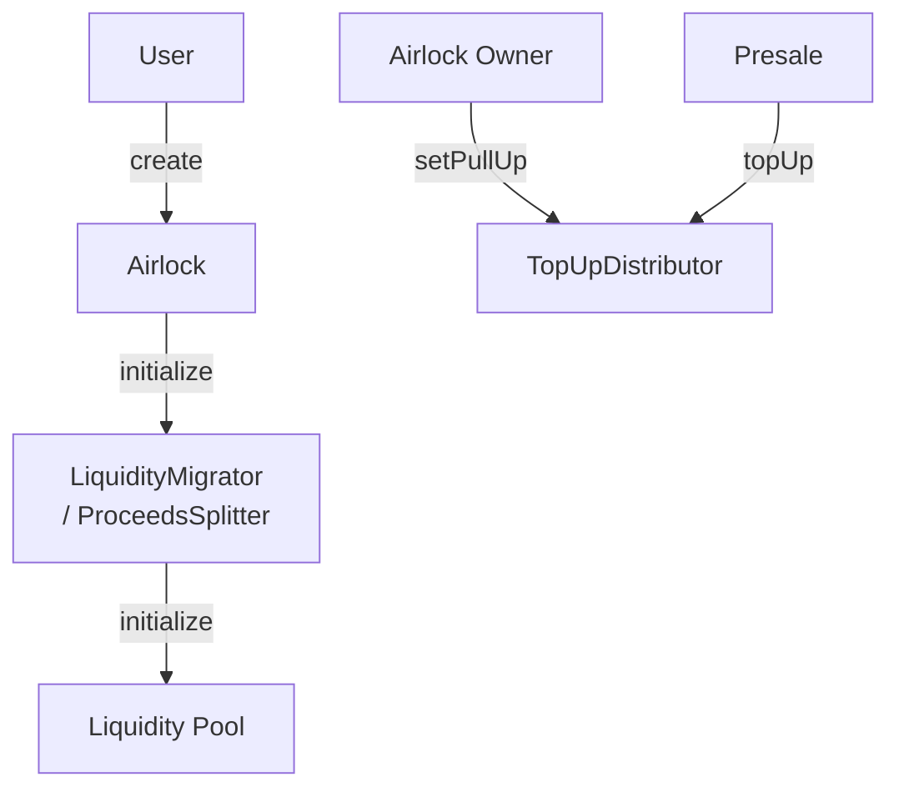
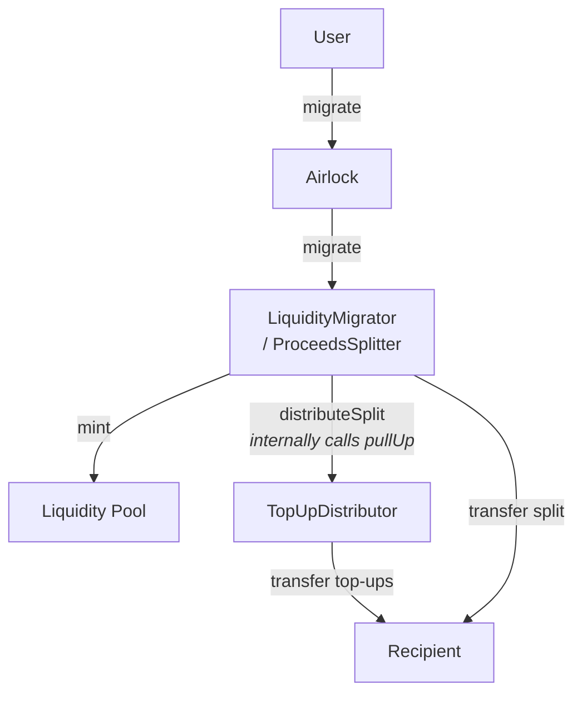

# Proceeds Splitter

## Overview

The `ProceedsSplitter` base contract introduces a new mechanism for distributing a share of the proceeds to a specified recipient during the asset migration process. The recipient must be passed to the associated `LiquidityMigrator` during the creation of the asset along with the share of the proceeds they are entitled to. Here are some key points:

- Only numeraire tokens can be distributed to the recipient
- The numeraire can be either an ERC-20 token or native ETH (represented as `address(0)`)
- A maximum of 50% of the proceeds can be allocated to the recipient
- The share is expressed in WAD (i.e. 1e18 = 100%), so the maximum value is 0.5e18
- A share of 0 is valid — the recipient would only receive top-ups (if any) but no proceeds

Additionally, the `TopUpDistributor` contract is introduced, allowing the reception of top-ups in the form of the numeraire tokens (for example gathered from a token presale). The top-ups received are then distributed to the recipient of the proceeds splitter during migration. Top-ups are permissionless (anyone can call `topUp`) and cumulative (multiple calls stack).

> **Note:** If an asset never migrates, any top-ups sent to the `TopUpDistributor` for that asset are locked permanently — there is no recovery or withdrawal mechanism.

Here is the initialization flow:

Here is the migration flow:

## Technical Details

### Proceeds Splitter

The `ProceedsSplitter` contract is designed to be inherited by `LiquidityMigrator` contracts. This means that any migrator contracts that require the functionality need to be updated and redeployed. Data are passed via the `liquidityMigratorData` field of the `CreateParams` structure during the `create` call to the `Airlock` contract.

The `ProceedsSplitter` constructor takes a `TopUpDistributor` address, coupling the two contracts. During migration, the internal `_distributeSplit` function both pulls up any pending top-ups from the `TopUpDistributor` and transfers the proceeds split to the recipient in a single call.

Asset / numeraire pairs are stored using canonical token ordering (`token0 < token1`) throughout.

### TopUpDistributor

The `TopUpDistributor` contract is a standalone contract that can be used to receive top-ups in the form of numeraire tokens for a specific asset. The top-ups received are then pulled up (by an approved migrator) and distributed to the recipient of the proceeds splitter during migration.

Key details:

- **Migrator authorization:** Before a migrator can call `pullUp`, it must be approved via `setPullUp(address migrator, bool canPull)`. Only the Airlock owner can call `setPullUp`.
- **Token ordering:** The `topUp` function sorts the asset/numeraire into canonical order automatically. However, `pullUp` callers must pass correctly ordered `token0` / `token1` addresses.
- **ETH support:** When the numeraire is native ETH, callers pass `address(0)` as the numeraire and attach the corresponding `msg.value`.
