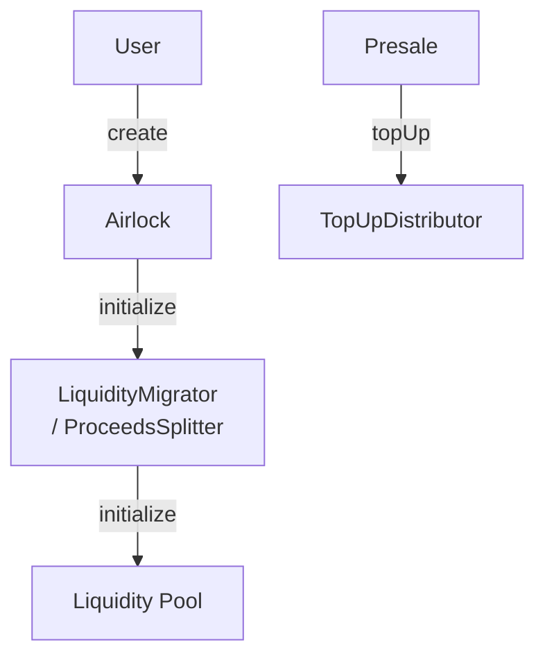
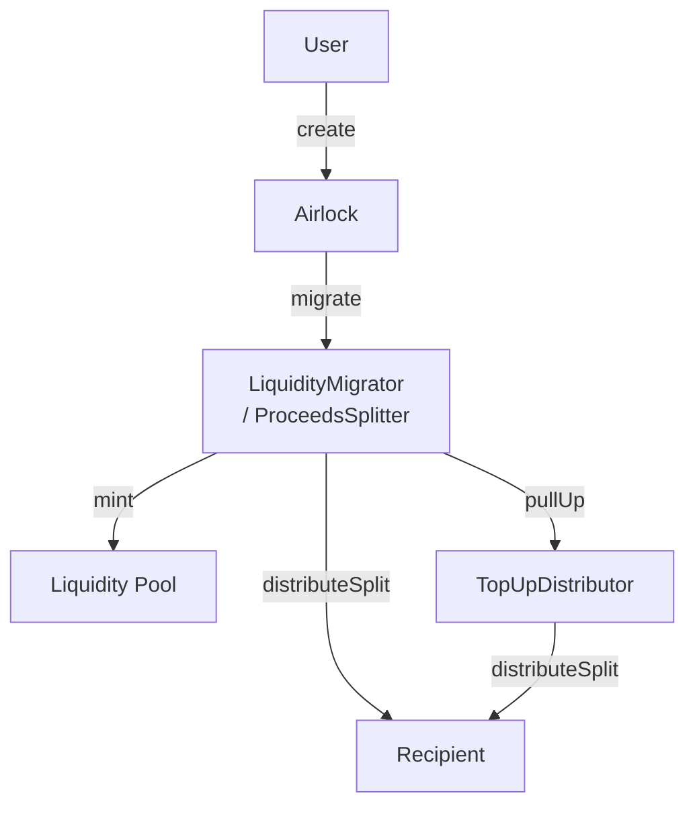

# Proceeds Splitter

## Overview

The `ProceedsSplitter` base contract introduces a new mechanism for distributing a share of the proceeds to a specified recipient during the asset migration process. The recipient must be passed to the associated `LiquidityMigrator` during the creation of the asset along with the share of the proceeds they are entitled to. Here are some key points:

- Only numeraire tokens can be distributed to the recipient
- A maximum of 50% of the proceeds can be allocated to the recipient

Additionally, the `TopUpDistributor` contract is introduced, allowing the reception of top-ups in the form of the numeraire tokens (for example gather from a token presale). The top-ups received are then distributed to the recipient of the proceeds splitter during migration.

Here is the initialization flow:

Here is the migration flow:

## Technical Details

### Proceeds Splitter

The `ProceedsSplitter` contract is designed to be inherited by `LiquidityMigrator` contracts. This means that any migrator contracts that require the functionality need to be updated and redeployed. Data are passed via the `liquidityMigratorData` field of the `CreateParams` structure during the `create` call to the `Airlock` contract.

### TopUpDistributor

The `TopUpDistributor` contract is a standalone contract that can be used to receive top-ups in the form of numeraire tokens for a specific asset. The top-ups received are then pulled up (by an approved migrator) and distributed to the recipient of the proceeds splitter during migration.
