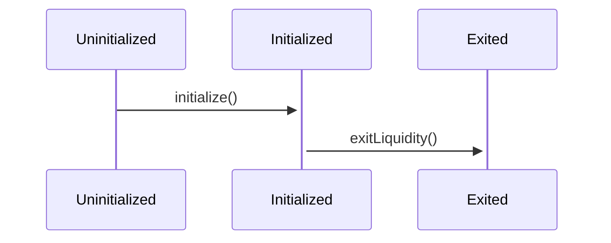
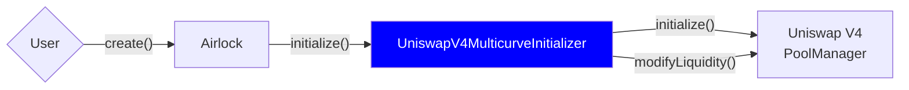
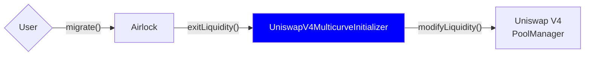
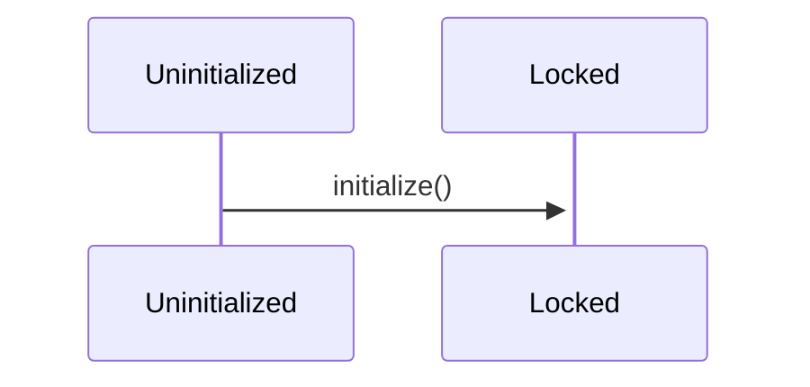
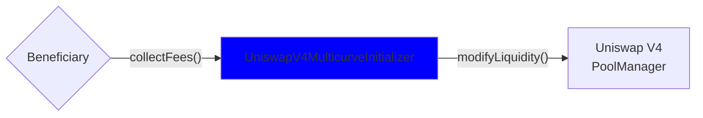

# UniswapV4MulticurveInitializer

| Module Name                          | Type              | Status    |
| ------------------------------------ | ----------------- | --------- |
| `UniswapV4MulticurveInitializer.sol` | `PoolInitializer` | `Testnet` |

## Overview

The `UniswapV4MulticurveInitializer` handles the distribution of liquidity across multiple positions, allowing the creation of different curves, as described in the [Doppler Multicurve whitepaper](https://www.doppler.lol/multicurve.pdf). Additionally, pools can be "locked", preventing the migration of liquidity out of the pool and enabling fee collection for multiple beneficiaries.

## Pool Initialization

### Initialization Parameters

On initialization, different parameters can be provided to configure the pool:

| Parameter       | Type            | Description                                                                |
| --------------- | --------------- | -------------------------------------------------------------------------- |
| `fee`           | `uint24`        | Fee tier of the pool, as defined by Uniswap V4, capped at 1,000,000 (100%) |
| `tickSpacing`   | `int24`         | Tick spacing of the pool, maximum of `32767`                               |
| `curves`        | `Curve[]`       | Array of curves, see below for details                                     |
| `beneficiaries` | `Beneficiary[]` | Array of beneficiaries, see below for details                              |

#### Curve Structure

The `Curve` structure (defined in the `Multicurve` library), defines the parameters for each curve in the pool:

| Parater        | Type      | Description                                                                                   |
| -------------- | --------- | --------------------------------------------------------------------------------------------- |
| `tickLower`    | `int24`   | Lower tick of the curve, must be a multiple of `tickSpacing`                                  |
| `tickUpper`    | `int24`   | Upper tick of the curve, must be a multiple of `tickSpacing`                                  |
| `numPositions` | `uint16`  | Number of positions to create within the curve, must be at least `1`                          |
| `shares`       | `uint256` | Weight of the curve in relation to other curves, must be greater than `0`, expressed in `WAD` |

For each curve, the liquidity will be distributed across the different positions on a logarithmic scale, ensuring a balanced distribution of liquidity. Providing multiple curves allows for a more complex liquidity distribution, enabling strategies that can adapt to different market conditions.

#### Beneficiary Structure

See the `BeneficiaryData` documentation for details.

### Pool States

After initialization pools can be in two different states: `initialized` or `locked`.

### Migrable Pools

"Migrable" pools can have their liquidity migrated out of the pool as soon as all the supplied assets have been fully sold. This is the default behavior.

Here is the state transition diagram for a migrable pool:

#### Initialization

Here is the flow for initializing a migrable pool:

#### Migration

Here is the flow for migrating liquidity out of a migrable pool:

### Locked Pools

On the other hand, "locked" pools prevent liquidity migration out of the pool, allowing for fee collection by multiple beneficiaries. This behavior is enabled by providing beneficiaries during initialization.

Here is the state transition diagram for a locked pool:

#### Initialization Flow

Same as the "classic" pool flow.

#### Fees Collection

Here is the flow for collecting fees from a locked pool:

